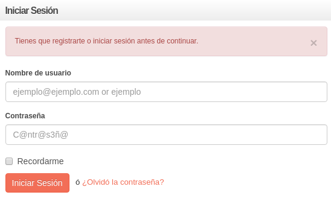
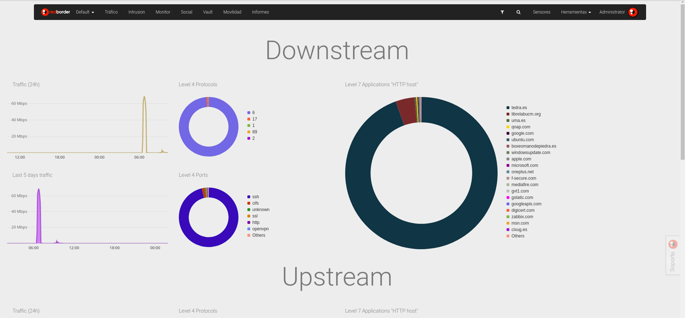
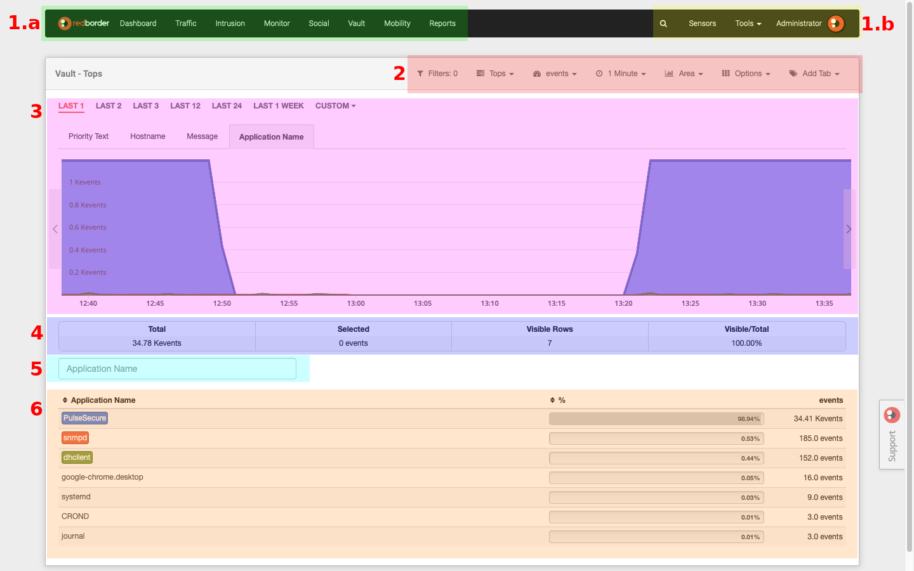
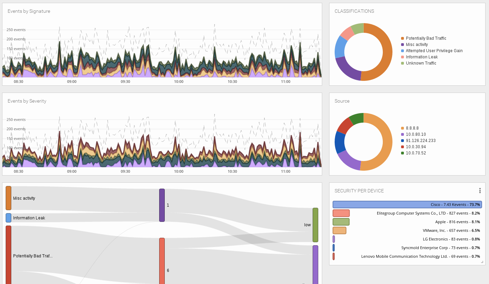
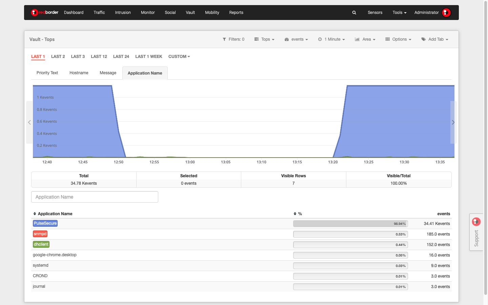
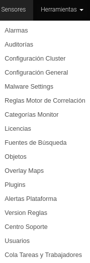

# RedBorder Web Platform

Once the Manager installation process is completed, the user can access the RedBorder web platform by entering the management IP address assigned to the Manager in the browser's address bar.

    https://manager-IP-address

Platform Access Screen

!!! info "Keep in mind..."

    It is possible to log in to the platform using the default account: **admin**.

!!! warning "Important"

    The management web will not work if attempted to be accessed through an unencrypted web (http).

Upon accessing RedBorder, the user is presented with a dashboard displaying various metrics and data about the status of sensors, domains, etc., or the location of sensors if configured.

This home screen is fully customizable. The user can create as many dashboards per profile as deemed necessary. (1)
{ .annotate }

1. In the case of the Community version, the number of customizable dashboards is limited to one per user profile.

Manager Home Screen Administration: Dashboard

## RedBorder Platform Interface Structure

RedBorder has a structure that is repeated in all RedBorder interfaces. Knowing these elements will help you navigate the web comfortably and easily. (1)
{ .annotate }

1. The image corresponds to a RedBorder installation with Traffic, Intrusion, Vault, and Mobility Apps active. The structure will be the same for any RedBorder installation, except for the available applications in the top menu bar and whether they are active or not.

Let's see these parts:

1. **Menu Bar**: Here you will find direct access to all sections of the RedBorder platform. It is subdivided into two areas according to functionality:
  
    1. *Analytics Area (upper left corner)*: here you will find all the data collected by the sensors displayed in different metrics and reports.
    - *Configuration Area (upper right corner)*: configuration and management options for Apps and RedBorder.

- **Submenu**: Shows the available options depending on the section we are consulting.

- **Main Area**: This is the content area. In this zone, data is displayed in different metrics and graphs that are fully customizable.

- **Summary**: Under the graph, you will find a summary with the information displayed in the metric, providing total values.

- **Search Engine**: Allows you to quickly search for any feature in the data table with the attribute being queried. You only need to enter the IP, sensor, client, etc. you want to query. Additionally, searches can be turned into filters, as we will see later.

- **Data Table**: Provides details of the information displayed in the metric. Additionally, different actions can be performed per row. These actions depend on the App being queried.

### Options included in the menu bar

Let's make a quick description of the options that can be found in the menu bar, both in the analysis and configuration areas. Functionality and configuration of these options will be analyzed in subsequent sections.

#### Analytics Area

*Dashboard*: Provides a summary of events received by a sensor, showing them in different metrics. This is the default screen displayed when accessing the RedBorder platform.

Dashboard

*Events*: Next, the user can view events whose information comes from sensors registered in their corresponding section. Later, each function and how these sensors are registered will be explained in detail. In the attached screenshot: Vault

Events

#### Configuration Area

*Search Engine*: Facilitates locating elements/values of the platform according to the search entered by the user.

*Sensors*: Shows the list of added sensors and the organization tree. It also contains global and local policies for each domain.

List of Sensors

*Tools*: Provides a list of configuration options that are available for the administrator profile.

Options available in Tools

*User*: This section shows a list of notifications, as well as the different options available for user management, contextual information of the platform, and the secure logout button: Logout.

Options available in Administrator

*Show Help*: Activating this option will bring up a pop-up providing assistance during manager administration navigation. It is identified with a question mark symbol.

