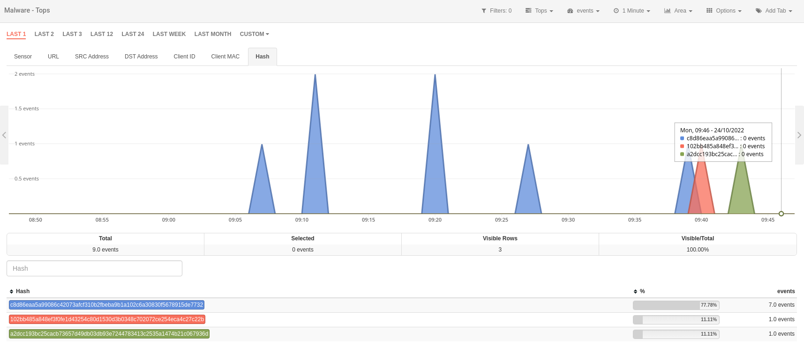

# Modules

In the **Events Section**, the user can **display, analyze, and manage** the events collected by the sensors.

RedBorder offers maximum network visibility thanks to the many options for data representation and visualization provided by our Apps.

The platform has a module for each functionality. Each one uses different technologies and has an independent interface. All modules need a sensor to provide them with data.

## Business Intelligence

The **Business Intelligence** module uses customer information through BI sensors. It can be used to obtain responses to questionnaires defined on the **[RBMobility](https://rbmobility.redborder.com)** platform.

This module is disabled by default, to activate it, run the following command from the console:

    rb_set_modules bi:1; chef_client

BI module

## Malware (WIP)

The **Malware** module is a complete solution for detecting malicious files, IP addresses, and URLs. Multiple detection engines and reputation services are employed, going beyond signature-based policies and similar techniques.

This module is disabled by default, to activate it, run the following command from the console:

    rb_set_modules malware:1; rb_set_malware_mode enable logstash; chef_client

Malware Module

## Traffic

The **Traffic** module uses NetFlow to extract information about all the sensor's traffic. The module provides information such as IPs, protocols, locations, and much more.

Traffic Module

## Intrusion

The **Intrusion** module uses data from the sensor or IPS sensors to display intrusion events based on Snort rules. Also, thanks to the different views included in RedBorder, it is possible to analyze the packets that matched the rule specification.

Intrusion Module

## Monitor

The **Monitor** module uses data from SNMP, Redfish, and IPMI protocols to display the status of the infrastructure.

Monitor Module

## Vault

The **Vault** module uses syslog data to provide information about events from different sources, such as category, target, event action, and more.

It is also possible to enhance the capabilities of the Vault module through extensions that add compatibility with other manufacturers.

Vault Module

## Mobility

The **Mobility** module provides location information for AP sensors in the network. It can be used to show how people move around in a building.

Mobility Module

## Wireless

The **Wireless** module provides an analysis of visitor data from AP network sensors **without taking into account movement calculations**.

Wireless Module

## Reports

The **Reports** module allows the user to have periodic reports with information about the RedBorder platform.

Reports Module
