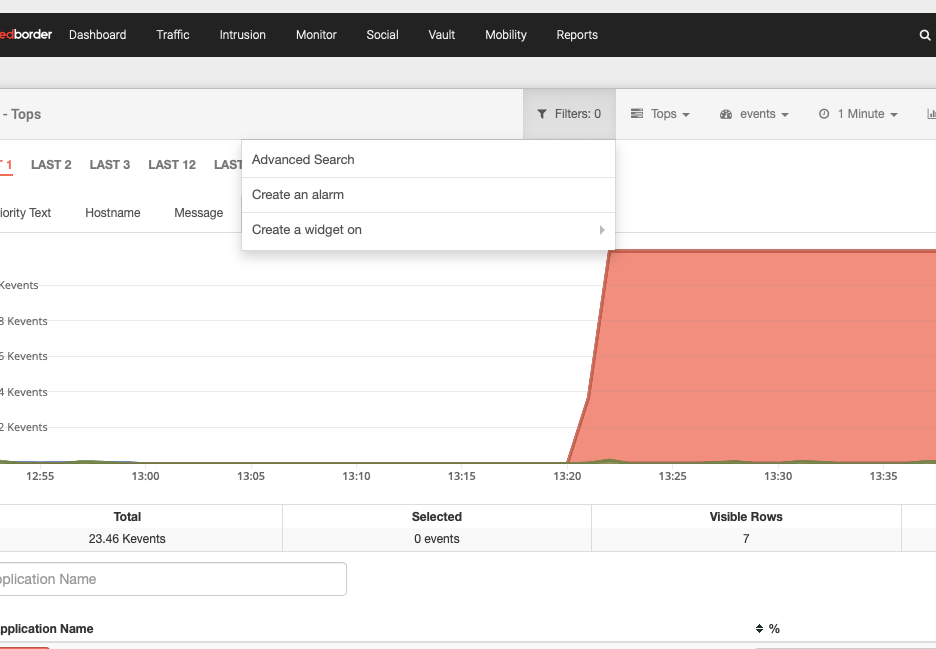
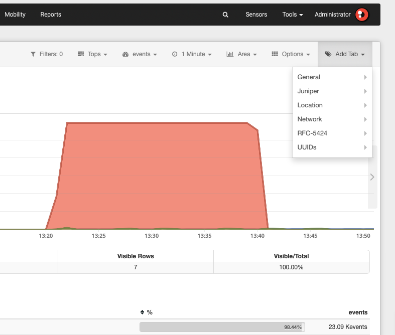

# Menu and Module Options

In the analysis area of the menu bar (top bar, left margin), we can find different sections corresponding to the Apps we have integrated into the RedBorder platform.

Later on, we will explore the different options for data visualization, types of charts, granularity (maximum degree of temporal detail for an event query), and attributes that can be combined to obtain a fully customizable network traffic visualizer.

Module Overview

## Options available in the submenu

Submenu Options

### Filters

Allow users to isolate a portion of the information for detailed inspection. In this tab, you can see the number of filters that have been applied to take actions on them:

- *Advanced search.*
- *Create an alarm.*
- *Create a widget.*

Filters

### Views

Offers different options for displaying information.

- *Raw*: Raw events.
- *Tops*: Shows the total sum of data from different events to display them as one.
- *Compare*: Comparison of events within a time period.
- *Unique*: Display the number of unique events, grouped as indicated.

Views

### Aggregation

There are different values or units of measure in which the data can be displayed. For example, flows per second (flows/s) or bytes per second (bps). Note that each module has its own aggregation options.

Aggregation

### Granularity

Indicates the degree of temporal detail that can be shown in the information. The minimum value for granularity is one minute.

Granularity

### Chart

Displays the different types of charts among which we can show the data. The available chart types vary depending on the selected view. They are as follows:

Chart Type: Area

Chart Type: Lines

Chart Type: Bars

Chart Type: Stacked Bars

Chart Type: Accumulated

### Options

In this section, the user can perform various actions to manage the data being displayed. The options vary depending on the selected view.

- *Show filtered total/Hide filtered total*: shows or hides the chart considering the selected filters.
- *Export to CSV*: Provides the option to export a CSV report of any selected field by selecting the event limit.
- *Time Machine*: Allows changing the date/time of the machine to view all information and events that have occurred in that time period.
- *Sort aggregations*: Allows changing the order of the aggregations displayed in the module.
- *Save tabs as default*: By selecting this option, the default tabs layout can be modified.

Options

### Attributes

Events received by the Manager consist of a "column: value" pair. The values given in each column can be understood as specific event data that actually provide information. These are called "attributes".

Attributes can be displayed in different ways: as tabs or as columns (Add Tabs/Columns) depending on the view you are in.

Attributes

All attributes have specific meaning and functionality. For example, in the Traffic module, we can observe highly relevant attributes such as *Public IP*, which shows the real IP address of devices on the network, *Public IP MAP*, indicating their position on the map, or *Country Code*, which indicates the country they belong to.

Attributes: Overview

## Body of the screen

### Time Filtering

Located to the left, a bit below the submenu, are shortcuts to filtered events based on time periods. The periods defined in the platform are Last Hour, 2 hours, 3 hours, 12 hours, 24 hours, and Last Week.

Time Period Filters

There is the possibility to select a different time period than the default one offered. Depending on the user's needs, a custom selection of the period can be made using the Custom option. The procedure to perform a custom time filter is specified later.

### Attribute Tabs

Classified information of network traffic by attributes. By browsing through each of the tabs, detailed values associated with the selected attributes can be explored.

Attribute Tabs

!!! info "Keep in mind..."
    The user can change the order in which the tabs are displayed at any time. To do this, simply drag and drop the tab to the desired position.

    This part of the body is not shown in the Raw view.

### View

In this area, the data is displayed according to the selected view and chart type. Placing the mouse over any of the points that make up the chart, a dialog box displays detailed information for that moment in time, aggregation, and attribute.

View

### Summary

Below the *View* area, there is a summary of all the data displayed, both in the view and in the table. In the following order, this summary indicates the total aggregation value of all loaded data, the total aggregation value of all loaded and selected data, the number of rows of loaded data, and the percentage of aggregated value of the loaded data from the total data.

Summary

### Search Engine

Allows searching by attribute. Searches are automatically converted into filters, as we'll see later.

Search Engine

### Data Table

Displays values classified by the selected attribute type. For example, each row could show each of the source IPs (Column/Attribute: SRC Address) with the percentage of detailed bytes (aggregation) that element consumes within the network.

For the isolated analysis of one or more elements from this bar (selecting as a filter), click on the element you want to filter and then press the corresponding button that will appear next to the search engine.

Data Table

!!! info "Keep in mind..."
    Hovering over any of the elements in the data table will display a menu with different actions that can be performed on that element. Depending on the type of attribute, sorting options will be displayed in the contextual menu.
