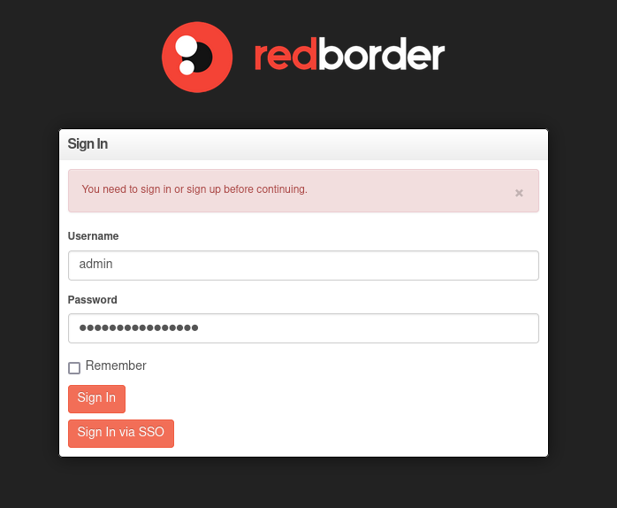

# Integrar Single Sign On con la Plataforma Web de redBorder

Esta documentación proporciona una guía paso a paso para integrar [Single Sign On](https://en.wikipedia.org/wiki/Single_sign-on) (SSO) utilizando el [protocolo SAML](https://en.wikipedia.org/wiki/SAML_2.0) con la Plataforma Web de redBorder. Siguiendo estas instrucciones, podrás habilitar SSO y configurarlo, permitiéndote iniciar sesión y registrarte en la Plataforma Web de redBorder.

Diagrama del Protocolo SAML:

```mermaid
sequenceDiagram
    autonumber
    actor Usuario
    Usuario->>SP: Haz clic en el botón "Iniciar sesión vía SSO"
    SP-->>Usuario: Iniciar proceso de inicio de sesión
    Usuario->>+IdP: Iniciar el servicio de inicio de sesión del IdP
    note over IdP: Identificar/Autenticar al usuario
    IdP-->>-Usuario: IdP genera SAML encriptado
    Usuario->>SP: Enviar la respuesta SAML
    SP-->>Usuario: Si la respuesta SAML contiene el campo autenticado correctamente, SP responde con la información solicitada
```

## Habilitar SSO

Primero, necesitas habilitar el sistema de inicio de sesión SSO. Para eso, ve al siguiente archivo y verifica si hay una línea como esta:


```title="root/rails/config/redborder_config.yml"
authentication_mode: saml
```

!!! info "Ten en cuenta..."

    Si en lugar de `saml` está escrito `database`, modifícalo y reinicia el servicio.


Después, el sistema de inicio de sesión SSO estará habilitado. Puedes comprobarlo yendo a la ruta de inicio de sesión y viendo que hay un botón "Login via SSO" como en la imagen de debajo.

  

## Configurar la interfaz web de redBorder para usar SSO

1. Ve a `Herramientas -> Integraciones`.
2. Haz clic en la tarjeta **"Single Sign On"**.
3. Rellena los campos con los valores correspondientes.
4. Presiona el botón **"Actualizar"** para aplicar los cambios.

### Parámetros configurables


=== "Parámetros del IdP"
    - **URL de destino del IdP SSO**: Esta es la URL que redirige al IdP cuando deseas iniciar sesión.
    - **URL de destino del IdP SLO**: Esta es la URL que redirige al IdP cuando deseas cerrar sesión. Hay algunos IdPs que no tienen esta configuración, entonces escribe la ruta de cierre de sesión de redBorder: `<host>/users/logout`
    - **Certificado del IdP**: El certificado único proporcionado por el IdP que permite descifrar la respuesta encriptada de la autenticación y obtener los atributos del usuario.
    - **Atributos del IdP**: Estos son los nombres de los atributos de la respuesta del IdP. Contiene los datos necesarios para el inicio de sesión/registro. Hay muchos esquemas (ver los más comunes [aquí](https://wiki.surfnet.nl/display/surfconextdev/Attributes+and+SAML#AttributesandSAML-Attributeschemas)).
    - Correo electrónico: El correo electrónico del usuario.
    - Nombre: El nombre del usuario.
    - Nombre de usuario: El id que será registrado o usado para iniciar sesión.

=== "Parámetros del SP"
    - **ID de Entidad del SP**: Esta es la URL del SP que recibirá los metadatos del IdP.

## Registro e inicio de sesión

Después de configurar todos los ajustes, se puede iniciar sesión mediante SSO. Para usarlo, vaya a la ruta de inicio de sesión y se verá un botón que se refiere a SSO. Tras hacerse click en él, la página se redirigirá al servicio SSO configurado del IdP.  

!!! Warning
    Si es la primera vez que se accede a redBorder, se necesitará iniciar sesión dos veces: la primera para el registro del usuario y la segunda para el inicio de sesión.
