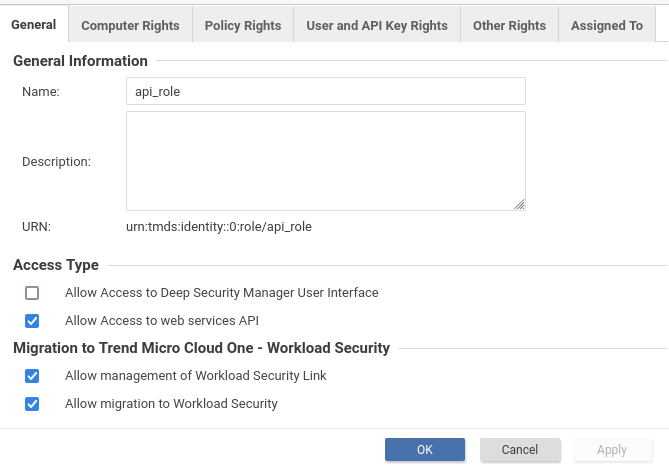
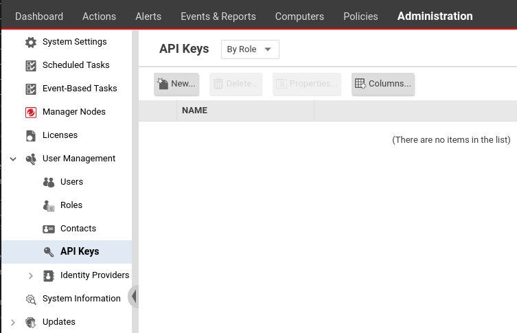
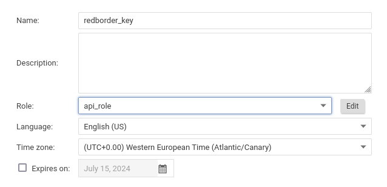

# Trend Micro

## Integrate Trend Micro with redBorder manager Web Platform

This documentation provides a step-by-step guide to integrating [Trend Micro Deep Security Manager](https://www.trendmicro.com/en_us/business/products/hybrid-cloud/deep-security.html?utm_content=ent_cloud+security_lg_e_es_wg_ao_search&ent_cloud+one_lg_e_es_wg_ao_search&gad_source=1&gclid=Cj0KCQjwkdO0BhDxARIsANkNcrel8Dzy3FK5eq43xqTjoUjEzbPHWa83z9Di5gBm_DLFxWQUQGkY3g8aAjV-EALw_wcB) with the redBorder Web Platform. By following these instructions, you will be able to enable the [Web Service API](https://automation.deepsecurity.trendmicro.com/article/20_0/api-reference/) in Deep Security Manager, allowing you to perform REST requests.

## Enabling the Web Service API

First, enable the Web Service API for Deep Security Manager. You can refer to the [Deep Security Help Center Documentation](https://help.deepsecurity.trendmicro.com/20_0/on-premise/welcome.html) for more details. 

1.- Navigate to *Administration -> System Settings*, and select the `Advanced` tab.


2.- Select `Enabled` under **SOAP Web service API**, then click `Save`. (Optional: Select Status Monitoring API)


## Create a Web Service role (Optional)

Next, create a role specifically for performing REST requests. This role will be used when creating an API Key and must be specified for the API Key role. You can configure the access permissions for this role, such as Alerts, IP Lists, or schedules.

!!! note

    You can customize the role configuration to suit your needs.

1.- Navigate to *Administration -> User Management -> Roles* and click `New` to create a role.


2.- Deselect the `Allow Access to Deep Security Manager User Interface` check box and select the `Allow Access to web services API` check box.



3.- Configure other settings as needed, such as Computer or Policies Rights, then click `Apply` and `OK`.

## Create API Key

1.- Navigate to *Administration -> User Management -> API Keys* and click to `New` button.



2.- Set a name and role for the API Key, then click `Next` button.



3.- Copy and paste the created API Key.


!!! warning

    Save the API Key carefully. If you lose it, you will not be able to retrieve it.

## Configure redBorder Web UI to Use the Trend Micro API

1. Go to `Tools -> Integrations`.
2. Click to the  **"Deep Security Manager (Trend Micro) API Integration"** card ("Get started" button).
3. Fill up the form.
4. Press **"Update"** button to apply the changes.


```http title="Example of Deep Security Manager URL"
https://dsm.example.com:4119
```