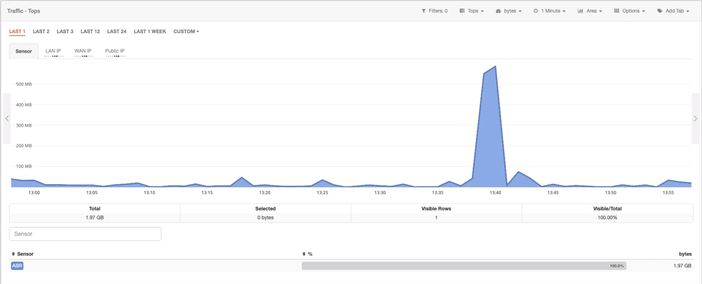
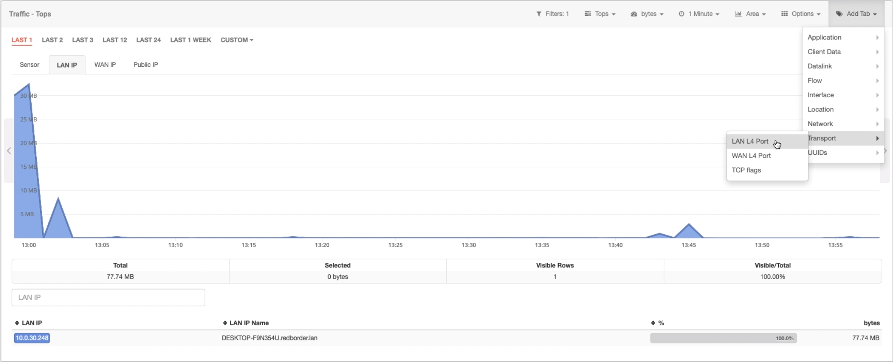
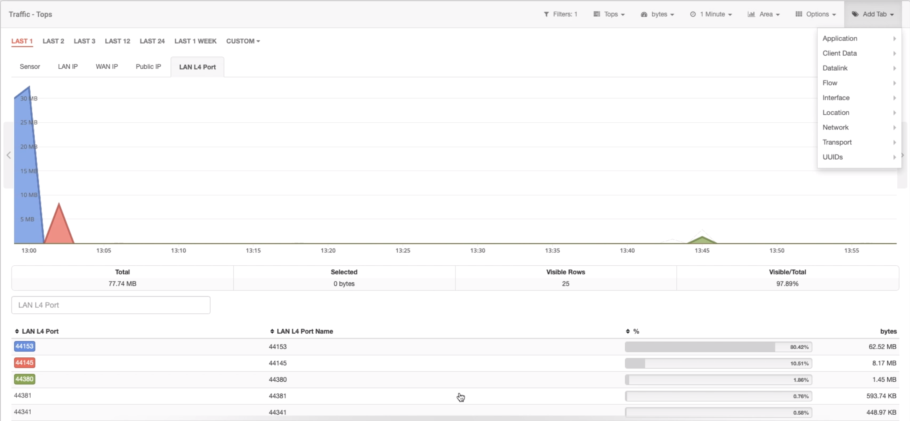

# Tracking an IP with Redborder

We can use Redborder to track a suspicious IP. It's possible to learn about its behaviour using the **Traffic** module.

First of all, we must know the IP we want to track. Once we have the IP, we will go to the **Traffic** module.

Tracking an IP: traffic module

Once in the **Traffic** module, we can use the **Advanced Search** from the Filter button to see only the traffic generated by that IP.

Tracking an IP: Advanced Search in Traffic module

Here we can set the suspicious IP to filter all the traffic. We will use the LAN IP metric for that purpose.

Tracking an IP: filtering IP

When we apply the filter, we will see only the traffic for that IP.

Tracking an IP: traffic filtered

It is possible to add new metrics to see the behaviour of the IP and what it is doing in our network.

Tracking an IP: adding new metrics

Now we can see what ports are being used by this IP.

Tracking an IP: ports being used by suspicious IP

With this use case, we can see how Redborder is able to filter the traffic for one or more IPs so the user can detect bad behaviours for particular IPs, being able to track IPs with only a few clicks.
