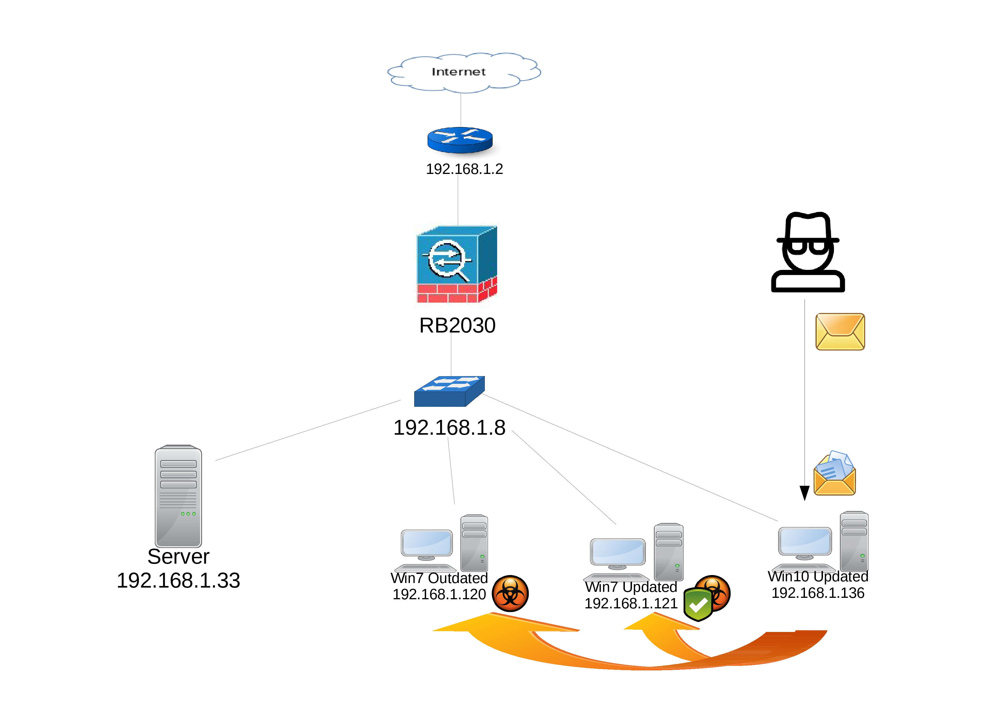
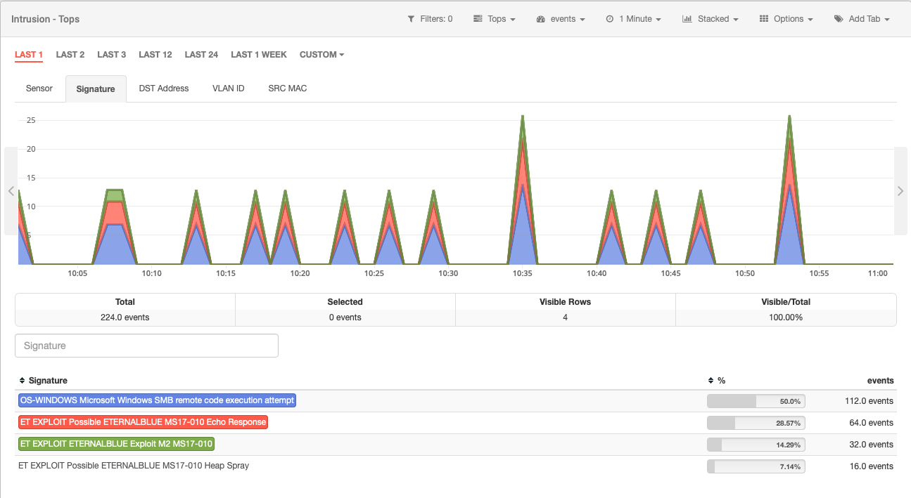
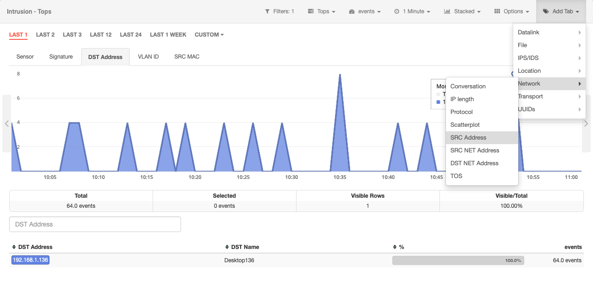
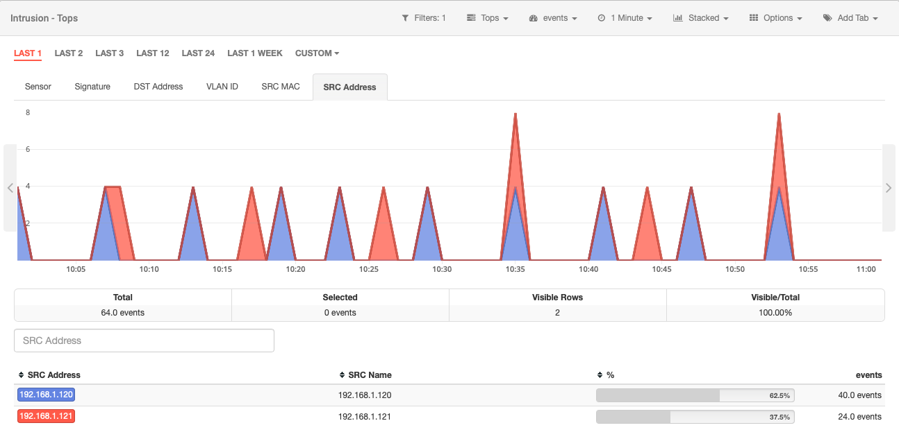

# Detectar un ataque de Eternalblue con Redborder

En este caso, veremos cómo Redborder puede usar las reglas de Snort para detectar un ataque de *Eternalblue*.

Todo comienza con un correo electrónico malicioso que contiene un *dropper* que instala un *ransomware*.

El *ransomware* intentará utilizar un *exploit* conocido para tomar el control de todas las máquinas posibles.

Ataque Eternalblue: escenario

Redborder puede usar las reglas de Snort para detectar la respuesta de eco del protocolo *SMBv1* utilizada por el *ransomware*, por lo que podemos usar el módulo de intrusión para ver las firmas para identificar el ataque.

Ataque Eternalblue: intrusión

Aquí podemos ver las firmas actuales recopiladas por Redborder.

Ataque Eternalblue: filtrando firmas

Una vez que hayamos filtrado la firma de *Eternalblue*, podemos mostrar la métrica *SRC Address* para rastrear las IP involucradas en el ataque.

Ataque Eternalblue: selección de métrica SRC Address

Ahora tenemos las IP de las máquinas involucradas, por lo que es posible tomar medidas para resolver el agujero de seguridad.

Ataque Eternalblue: IPs envueltas en el ataque

!!! info "Ten en cuenta..."

    Es importante tener una versión actualizada de las reglas de Snort para detectar comportamientos extraños y tráfico con Redborder.
