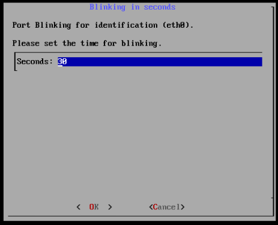
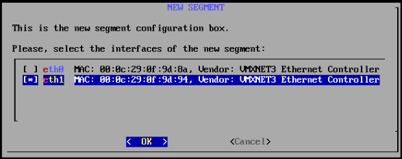
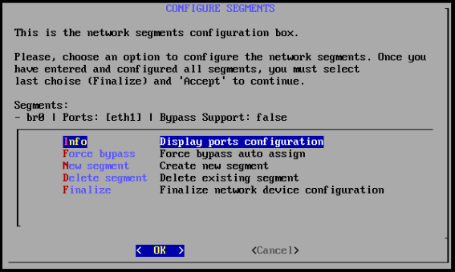
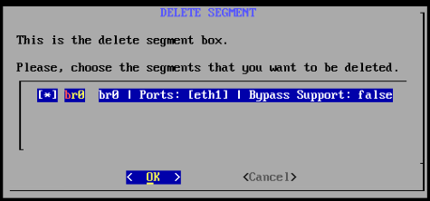

# Instalación del IPS de RedBorder


## Requisitos de la instalación

La implementación exitosa de RedBorder requiere una máquina con el sistema operativo **Rocky Linux 9** instalado. Los requisitos de hardware de la máquina deben ser como mínimo:

=== "IPS"

    * Disco: 50 GB
    * RAM: 16 GB
    * CPU: 4 núcleos
    * Interfaces de red: Al menos dos

## Proceso de instalación

La primera acción para comenzar a monitorizar tu red con RedBorder es obtener los paquetes oficiales más recientes de redBorder para **Rocky Linux 9** disponibles en [repo.redborder.com](https://repo.redborder.com).

``` bash title="Latest"
dnf install epel-release -y && rpm -ivh https://repo.redborder.com/ng/latest/rhel/9/x86_64/redborder-repo-1.0.0-1.el9.rb.noarch.rpm
```

``` bash title="IPS"
dnf install redborder-ips -y
```

Ya con los paquetes descargados e instalados, el siguiente paso es configurar RedBorder, para ello reniciamos la sesión en consola:

``` bash title="Comando de reinicio de consola"
/bin/bash --login
```

Esto actualizará las rutas a los scripts y así podremos ejecutar el comando de instalación:

!!! warning "Si está conectado a la máquina de manera remota..."
    El asistente de instalación no puede ser lanzado a través de SSH. En caso de estar virtualizado, utilize la consola proporcionada por el propio entorno de virtualización. Sino, tendrá que conectarse directamente a la máquina física.

``` bash title="Comando de instalación del programa de Redborder"
rb_setup_wizard
```

El cual iniciará el **asistente de instalación** de la plataforma en consola para funcionar como guía durante todo el proceso.

## Asistente de instalación

Habiendo iniciado el **asistente de instalación** para la plataforma en la consola, se puede utilizar como guía durante todo el proceso. La primera pantalla que se muestra nos ofrece también un índice de los próximos pasos.


Si no está seguro sobre la configuración actual, puede cancelar con la opción "No", la cual mostrará la siguiente pantalla antes de volver a la vista de la consola.

### Configuración de red

Normalización del nombre de las interfaces

Después de confirmar, el IPS se reiniciará y podremos reanudar lanzando de nuevo el asistente:

``` bash title="Comando de instalación del programa de Redborder"
rb_setup_wizard
```

En el recuadro inferior se listan las interfaces de red existentes en el equipo en cuestión. Debajo de todas las interfaces que posee el equipo, está la opción `Finalize`, que podemos seleccionar **después de haber configurado** exitosamente las interfaces.


Configuración de red

Al seleccionar una interfaz y entrar en ella, se nos da la opción de configurarla con una dirección IP estática o que esta funcione dinámicamente (con DHCP).


Configuración de interfaz de red

En caso de seleccionar la opción de IP estática, se deberá especificar la IP, la máscara de red y la puerta de enlace por defecto:


Configuración de interfaz estática

### Configuración de DNS

El asistente de instalación nos dará la opción de elegir si quieremos configurar servidores DNS. Es obligatorio configurar al menos un servidor, sin embargo, actualmente es posible configurar hasta 3 servidores DNS en la plataforma. Esto se puede hacer en la siguiente pantalla:


Configuración de DNS

<details>

<summary> PASO OMITIDO COLAPSADO </summary>
### Selección de la interfaz de administración

Se nos pedirá que seleccionamos una de las interfaces como interfaz de administración. Mientras que la interfaz de administración servirá para conectarse con otras máquinas de redborder o con equipos de administración, el resto de interfaces se ocuparán de leer y trasmitir tráfico.

!!! info "Recomendación"
Se recomienda utilizar la eth0 como interfaz de administración, y así queda claro qué la primera es la interfaz de administración


Selección de la interfaz de administración
</details>

### Configuración de segmentos

Los segmentos identifican aquellas redes a las que el IPS tiene acceso y sobre las cuales va a actuar como dispositivo de seguridad en red. Sobre las interfaces, es necesario declarar al menos un segmento, para que el IPS esté operativo.


#### Info

En info podremos ver la información relativa a cada interfaz de red, e incluso la podremos indentificar en la tarjeta de red física. Esto es útil para decidir cuáles van a ser los segmentos activos y qué debe conectarse físicamente con qué:


Información de segmentos

Al seleccionar una interfaz, deberemos elegir un tiempo de parpadeo de la interfaz física de red, lo que nos ayudará a identificarla en la máquina física en cuestión:



Parpadeo de interfaces

!!! important "Si selecciona una de las interfaces..."
    Puede volver a la configuración de segmentos pulsando **ESC** o elegir la duración de parpadeo. Durante el parpadeo de la interfaz, el proceso de instalación no continuará.

#### Force bypass (WIP)

#### Nuevo segmento

Para asignar un nuevo segmento, debemos seleccionar una de las interfaces disponibles

!!! important "En cuanto a la interfaz de administración..."
    Debe reservar la interfaz principal de administración y no debe ser asignada como segmento.



Crear un nuevo segmento

La creación de un nuevo segmento va a ser mostrado en una lista previa:



Nuevo segmento en la lista

#### Eliminar segmento

En el caso en el que queramos hacer la acción contraria, podemos eliminar los segmentos que queramos de la lista. Podemos seleccionar los que queramos eliminar:



Eliminación de segmentos

Y desaparecerán de la lista previa:


#### Finalizar

Cuando hayamos configurado los segmentos deseados. Pulsamos **finalizar**.

### Nombre de host y dominio

Durante la instalación, se da la opción de decidir cuál será el nombre de host para el nodo de RedBorder, así como también el dominio utilizado para la comunicación con posibles servidores Proxy de RedBorder o IPS de RedBorder.

El nombre de host a escoger debe respetar el estandar **RFC1123**.

!!! info "Ten en cuenta..."
    El asistente de instalación genera automáticamente un nombre de host aleatorio para la máquina, así como también indica un nombre de dominio por defecto, que se recomienda no cambiar a menos que sea necesario, con el fin de que pueda registrarse contra los managers


Configuración de hostname y dominio

### Finalizando la configuración

Para finalizar el proceso de instalación, el IPS necesita un poco de tiempo, pero eventualmente nos devolverá a la consola, confirmando que se ha 


