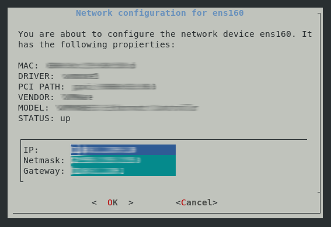
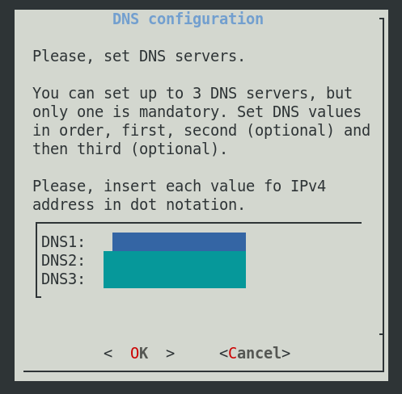
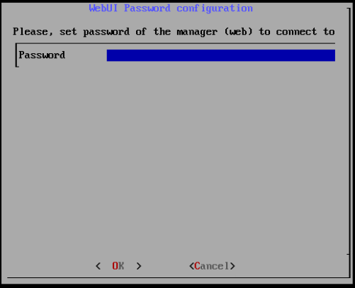
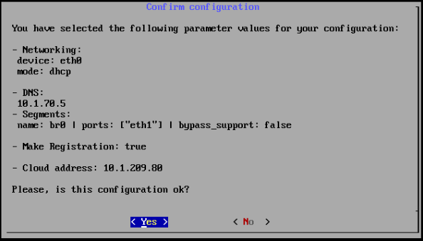
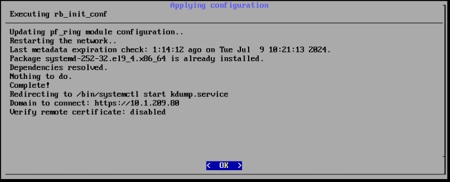

# Installation of RedBorder IPS

The following details the basic installation of a RedBorder IPS, which will be used to analyze traffic and detect intrusions. Due to the specific and heavy workload, it is necessary to have a dedicated machine for this purpose.

There are two installation modes for the IPS: the minimal version that emulates the behavior of a **proxy** and the integrated version on a node that acts as both an IPS and a **manager**. Depending on how we plan to install the IPS, we will use one or the other.

## Installation Requirements

The successful implementation of the RedBorder IPS requires a machine with the **Rocky Linux 9** operating system installed. Additionally, the preinstallation of a RedBorder **Manager** against which to register the IPS is necessary. Here are the specifications for this IPS:

=== "Recommended"

    * Disk: 50 GB
    * RAM: 16 GB
    * CPU: 4 cores
    * Network Interfaces: At least two

## Installation Process

The first action to start monitoring your network with RedBorder is to obtain the latest official RedBorder packages for **Rocky Linux 9** available at [repo.redborder.com](https://repo.redborder.com).

``` bash title="Latest"
dnf install epel-release -y && rpm -ivh https://repo.redborder.com/ng/latest/rhel/9/x86_64/redborder-repo-1.0.0-1.el9.rb.noarch.rpm
```

``` bash title="Command to install redborder IPS"
dnf install redborder-ips -y
```

With the packages downloaded and installed, the next step is to configure RedBorder. To do this, restart the session in the console:
``` bash title="Command to restart the console"
/bin/bash --login
```

This will update the paths to the scripts, allowing you to execute the installation command:

``` bash title="Command run the setup wizard"
rb_setup_wizard
```

!!! warning "If you are connected to the machine remotely..."
    The setup wizard cannot be launched via SSH. If virtualized, use the console provided by the virtualization environment. Otherwise, you will need to connect directly to the physical machine.

## Installation Wizard

Having started the **installation wizard** for the platform in the console, it can be used as a guide throughout the process. The first screen shows an index of the upcoming steps.


Starting the wizard

If you are unsure about the current configuration, you can cancel with the "No" option, which will display the next screen before returning to the console view.

### Network configuration

#### Normalizing interfaces names


Name normalization

After confirming, the IPS will restart, and you can resume by launching the wizard again:

``` bash title="Command run the setup wizard"
rb_setup_wizard
```

In the lower box, the existing network interfaces on the machine are listed. Below all the interfaces the machine has, there is the **Finalize** option, which can be selected **after successfully configuring** the interfaces.


Network Configuration

When selecting an interface and entering it, you are given the option to configure it with a static IP address or to have it work dynamically (with DHCP).


Network Interface Configuration

If selecting the static IP option, you must specify the IP, subnet mask, and default gateway:



Static Interface Configuration

### DNS Configuration

The installation wizard will give you the option to choose whether to configure DNS servers. It is mandatory to configure at least one server; however, up to 3 DNS servers can currently be configured on the platform. This can be done on the following screen:



DNS Configuration

<details>
<summary> OMITTED STEP COLLAPSED </summary>
### Selection of the Management Interface
You will be asked to select one of the interfaces as the management interface. While the management interface will be used to connect with other RedBorder machines or management systems, the other interfaces will be used to read and transmit traffic.

!!! info "Recommendation"
    It is recommended to use eth0 as the management interface to clearly identify it as the management interface.

image

Management Interface Selection

</details>

### Segment Configuration

Segments identify those networks to which the IPS has access and on which it will act as a network security device. For the IPS to be operational, at least one segment must be declared on the interfaces.


Segment Configuration

#### Info

In info, we can view information related to each network interface and even identify it on the physical network card. This is useful for deciding which will be the active segments and what should be physically connected to what:


Segment Information

When selecting an interface, you should choose a blinking time for the physical network interface, which will help identify it on the physical machine in question:


Interface Blinking

!!! important "If you select one of the interfaces..."
    You can return to segment configuration by pressing **ESC** or choose the blinking duration. During the interface blinking, the installation process will not continue.

#### Force bypass (WIP)

#### New Segment

To assign a new segment, select one of the available interfaces.

!!! important "Regarding the management interface..."
You must reserve the main management interface and it should not be assigned as a segment.


Create a new Segment

The creation of a new segment will be shown in a previous list:


New Segment in the List

#### Remove Segment

If you want to perform the opposite action, you can remove the segments you want from the list. You can select the ones you want to remove:


Remove Segments

And they will disappear from the previous list:


Segment Configuration

#### Finalize Segment Configuration

Once you have configured the desired segments, press **finalize**.

## Node Mode

At this point, we need to choose the mode in which the IPS will operate. In proxy mode, the wizard will ask for the address of a manager to register with. On the other hand, in manager mode, the wizard will request the address of the manager acting as the **web server**; therefore, it will also ask for the **credentials** of the **administrator** user who is registering this IPS.

!!! info "Please note..."
Configuring the IPS in manager mode will automatically register the sensor with the web.

### Proxy Mode: Configuration with the Remote Server

The IPS will be associated with a manager or cluster with which to share the captured data. To associate it, it is necessary to specify the manager or cluster address. You can specify either a domain address or an IP address.


Configuration with Remote Server

### Manager mode: Web registration

The IPS will be associated with a manager that hosts the web interface. To enable this association, you need to provide the manager's address and the credentials of a user with administrative permissions. Additionally, you can modify the sensor's name when it is registered on the web:


IPS Registration Configuration

Upon clicking OK, you will be prompted for the password of the registered administrator on the **web**:



Web User Password

## End of Configuration

Before applying the configuration, the wizard will summarize all the information filled out, waiting for the user to accept it.



Accept Configuration

## End of Installation

The installation is almost complete; you only need to wait for the process to finish.



Applying Configuration

Click "OK" to return to the console view.

Additionally, you can view the registration process logs with the following command:

``` bash title="Command run the setup wizard"
journalctl -u rb-register -f
```

At the end of the installation process, the journal will display the following:


End of installation

## What's Next?

In the following chapter, we will finish associating the IPS with the manager so that it can handle traffic and alert you to any detected intrusions. All of this will be manageable from the web.

!!! info "If you installed the IPS in manager mode..."
Remember that if you have installed the IPS in manager mode, the association process should already be complete.
