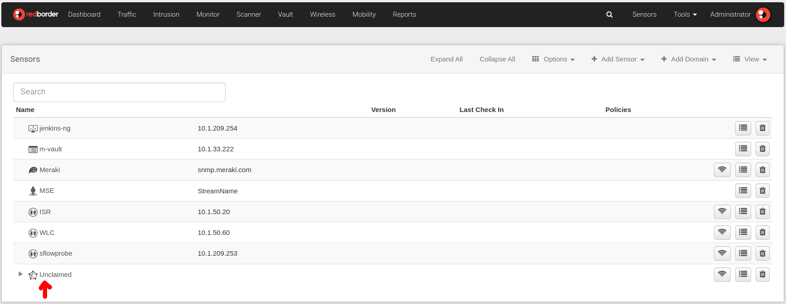
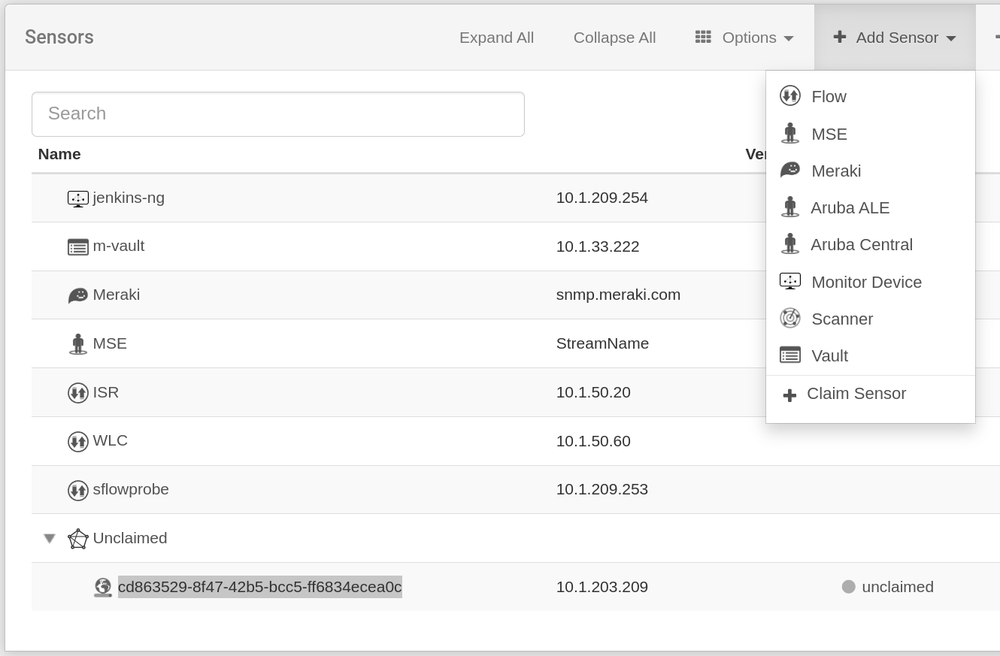
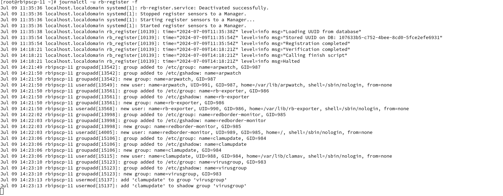

# Sensor IPS

## Identificar el sensor IPS

En el caso de que el IPS se haya instalado en modo **proxy**, es necesario reclamar el sensor en el manager para empezar a retransmitir los datos provenientes del IPS. Para ello, hay que dirigirse a la web a la sección **Sensors**. En la lista de sensores deberíamos ver una sección llamada **Unclaimed**.



Sensores sin reclamar

Este menú se puede desplegar haciendo click sobre él y podremos ver la lista de sensores pendientes de ser reclamados por el manager. 


IPS sin reclamar

El icono de **escudo** nos indica que este sensor ha sido identificado como un ips.

!!! info "Tenga en cuenta..."
    La IP que se muestra en el sensor del ips se corresponde con la interfaz de management.

En caso de que el IPS se haya instalado en modo **manager**, tan sólo tenemos que comprobar que el sensor ya se ha reclamado correctamente:


IPS en modo manager reclamado

## Reclamar el sensor de IPS

A modo de nombre, el IPS se encuentra identificado con un identificador único de caracteres hexadecimales. Sirve como enlace para reclamar el sensor. Vamos a seleccionar el identificador:


Selección del UUID

Copiamos pulsando CTRL + C, pulsamos 'Añadir Sensor' y 'Reclamar Sensor':



Acción de reclamar un sensor

Esto nos mostrará la siguiente ventana:


Propiedades de reclamación

En el campo 'Nombre' introducimos un nombre cualquiera y el campo 'UUID' pegamos el identificador que copiamos previamente. Una vez rellenados los campos pulsamos **Guardar**. Esto encolará la configuración del IPS. La web nos los mostrará con indicador en sus propiedades.


Configuración y reclamación

## Autoconfiguración del sensor IPS

Si tenemos acceso a una consola de la propia máquina, podemos observar el proceso de instalación con el journal:

``` bash title="Print the setup logs"
journalctl -u rb-register -f
```



Logs del registro

Al finalizar todo el proceso de registro, el indicador del sensor actualizará su estado como **configurado (verde)** en caso positivo, o **fallido (rojo)** en caso negativo:


IPS configurado
