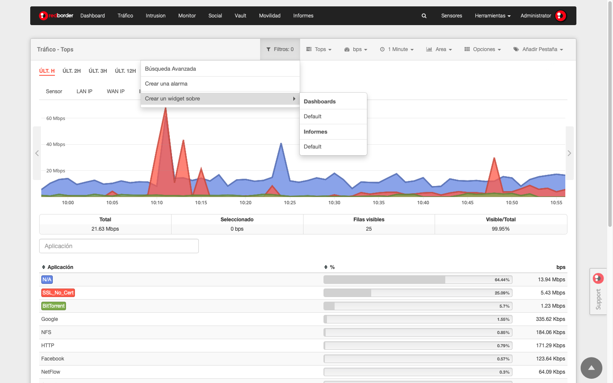

# Filtrado de eventos

En el submenú de la sección existen muchas opciones que nos permiten visualizar eventos de acuerdo a sus necesidades de análisis.

Una de estas opciones es **Filtros** que permite el filtrado de eventos de acuerdo a los criterios definidos por el usuario. Estos filtros puedne ser guardados para ser usados más tarde para mostrar los eventos.

## Opciones de filtrado

- **Filtrar zoom**: Eventos aislados gráficamente de acuerdo a un periodo de tiempo.
- **Filtrar seleccionado**: nos permite convertir uno o más elementos filtrados en la tabla.
- **Búsqueda avanzada**: permite establecer condiciones para una búsqueda avanzada actuando como filtro. Es muy útil para aislar y analizar datos concretos.

## Acciones de filtrado

- **Filtros guardados**: muestra una lista de filtros guardados.
- **Crear una alarma**: permite establecer una alarma basada en los filtros aplicados.

Herramientas -> Alarmas

- **Crear un widget**: crea un widget basado en los criterios de búsqueda que puede ser incluido en dashboards o informes. Sin embargo, no todos los widgets pueden ser aplicados a informes.

## Filtrar eventos por tiempo

Es posible aislar los eventos correspondientes a un periodo de tiempo para analizar en más detalle los datos asociados con el atributo seleccionado.

Hay cinco modos de hacer un filtro temporal:

- Filtro por periodo de tiempo
- Filtro Zoom
- Filtro personalizado
- Búsqueda avanzada
- Filtro por atributo

### Filtro por período de tiempo

Un modo simple y rápido para ver únicamente eventos correspondiente a un periodo específico de tiempo es seleccionar algunas de las opciones que proporcionan el filtro de la línea de tiempo de pestañas:

Filtrado de eventos, línea de tiempo

### Filtro zoom

El usuario puede seleccionar un periodo de tiempo manualmente. Para esto se puede clicar con el ratón en un punto específico del gráfico, arrastrar y soltar hasta el instante de tiempo deseado. Después podrá ver el periodo de tiempo expandido en el gráfico.

Luego de hacer lo anterior, podrá ver una opción nueva en el submenú: **Filtrar zoom**

Filtrado de eventos, filtro zoom

### Filtro personalizado

La pestaña **Personalizado** de la línea de filtrado del rango de tiempo permite un filtro personalizado. Arrastrando el ratón de un punto a otro en el mes  que quiere consultar se mostrarán los datos específicos. Por lo tanto, tenemos la vista para ese rango de tiempo y la tabla a continuación muestra solo los datos contenidos en esta tira.

Click en **Enviar** para aplicar el filtro.

!!! tip "Se recomienda..."
    Luego de seleccionar el tiempo **Personalizado**, es posible usar el filtro por zoom si se desea analizar un período de manera más precisa.

### Búsqueda avanzada

Para usar esta opción, haga click en la pestaña **Filtros** que muestra un submenú en el cual podemos encontrar la opción **Búsqueda avanzada**.

Esta es la opción que permite obtener más detalle, ya que es el usuario quien determina las condiciones de la búsqueda y, por lo tanto, del filtrado. Puede elegir entre todos los atributos disponibles para esta aplicación.

Puede agregar tantas condiciones de filtrado como considere necesarias, solo asegúrese de indicar el atributo, la fecha de inicio y la fecha de finalización que desea consultar.

- *Añadir regla de búsqueda*: click (+)
- *Borrar regla de búsqueda*: click (-)

Filtrado de eventos, búsqueda avanzada

Puede guardar esta configuración de búsqueda como un filtro, por lo tanto, estará disponible para consultar en cualquier otro momento, tanto en la opción **Ver filtros guardados** como en **Filtros guardados** que encontrarás en el menú contextual de los filtros.

Para cargar un filtro guardado, puede usar el botón **Ver filtros guardados**, seleccionando el filtro y haciendo clic en el botón Agregar filtro.

Filtrado de eventos, filtro guardado

### Filtro por atributo

Hay dos maneras de convertir un valor de un atributo en un filtro:

- *Motor de búsqueda*: introduzca el valor del atributo que desea encontrar y presione Enter. El filtro elegido se incluirá automáticamente. Puede incluir tantos filtros como búsquedas realizadas.
- *Selección de columna en la tabla*: puede seleccionar una o más filas de la tabla para aislar los datos relacionados con dichos elementos. Para la selección múltiple, haga click sobre los diferentes elementos que desea filtrar; Si desea anular la selección, vuelva a hacer clic en los elementos.

Una vez que se seleccionan las filas, habrá la opción de incluir o excluir los elementos gráficos, así como la tabla de datos. Para volver a incluirlos, presione el botón **Filtrar seleccionados** ubicado en la parte superior de la tabla de datos. Para excluirlos, es necesario presionar el botón **Excluir seleccionados** ubicado al lado del botón anterior.

Filtrado de eventos, incluir y excluir atributos

En el caso de una selección individual, es posible realizar el filtro o la exclusión más rápidamente:

1. *Al hacer clic en el nombre de un sensor, los datos se incluirán en la vista. En este momento, la etiqueta mostrará un color que corresponde a la línea / área / flow / barra que se muestra en la vista. Para excluir, haga clic en él nuevamente.*
2. *Abrir el menú desplegable junto a cada elemento de la tabla y contiene las siguientes opciones:*
    - **Filtro**: añade el filtro apropiado para incluir el elemento de los datos presentados.
    - **Excluir**: añade el filtro apropiado para excluir el elemento de los datos presentados.
    - **Copiar al portapapeles**: el valor del elemento seleccionado se copia en el portapapeles para que esté disponible para posterior uso.

Filtrado de eventos, filtrar por atributo
