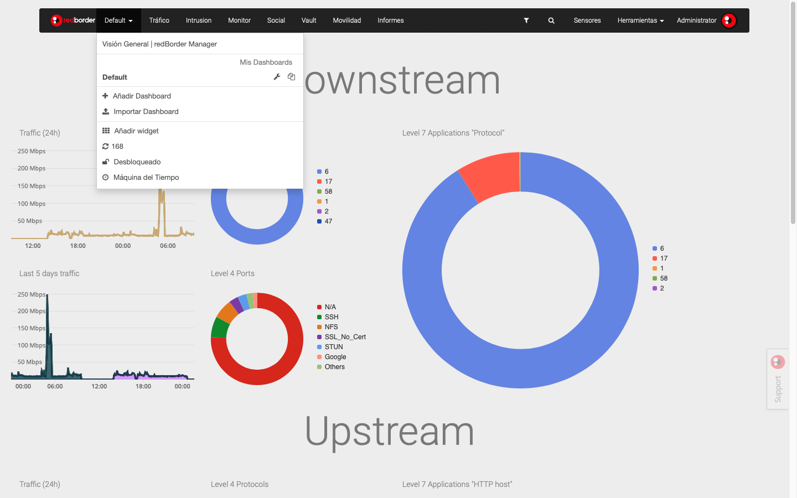
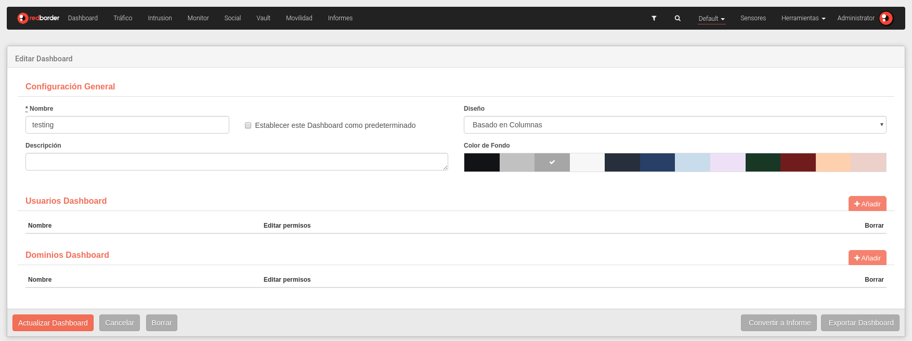

# Dashboards

## Opciones de dashboards

La primera opción que encontramos en la barra de menú en el área de análisis es el Dashboard. Esta es la opción seleccionada por defecto que verá tan pronto como inicie sesión en el Manager de Redborder:

Vista general del dashboard

La sección de Dashboard presenta diferentes opciones:

- **Lista de dashboards disponibles**: en la primera parte del menú del panel, el usuario verá los paneles que se han creado y están disponibles para su perfil.
Al lado de cada uno de los dashboards hay dos iconos. El primero, el icono de llave inglesa, nos permite ver y editar la configuración general del panel. El ícono Copiar a la derecha nos permitirá clonar el dashboard seleccionado.
- **Añadir dashboard/Importar dashboard**: Estas opciones le permiten añadir un nuevo panel de control personalizado e importar los que ya están creados, para compartirlos con otros usuarios o que estén disponibles para otros perfiles. El proceso de creación e importación del dashboard verá minuciosamente las líneas más adelante.
- **Añadir Widget**: añada los widgets que desea personalizar completamente sus paneles.
- **Tiempo de actualización**: Los datos en los dashboard se actualizan cada 5 minutos (300 segundos). Verá una cuenta regresiva del tiempo restante hasta la próxima actualización. Puede restablecer la cuenta haciendo clic en la figura que se muestra. En ese momento, aparecerá la palabra "Detenido". Haga clic nuevamente para iniciar la cuenta regresiva desde 300.
- **Desbloquear**: El usuario tiene la opción de bloquear / desbloquear el dashboard que está consultando para que ningún otro usuario con permisos pueda editar el dashboard.
Máquina del tiempo: Permite al usuario "viajar en el tiempo" y ver los resultados de las métricas de un día y hora en particular.

## Editar dashboard

El usuario puede modificar en cualquier momento la información asociada con cada uno de los dashboard disponibles seleccionando Configuración general, haciendo clic en el icono de la herramienta.

Información editable en la configuración general del dashboard:

- Nombre
- Establecer este dashboard por defecto
- Diseño
- Descripción
- Color de fondo
- Usuarios del dashboard: añadir y borrar
- Dominios del dashboard: añadir y borrar

Además, en la parte inferior de la pantalla, el usuario verá una serie de opciones disponibles:

- Actualizar dashboard
- Cancelar
- Borrar
- Convertir en informe
- Exportar dashboard: el sistema creará un archivo comprimido para la descarga; este es un paso necesario si quieres importar.

Editar dashboard

## Clonar dashboard

Es posible clonar (copiar) dashboards para tenerlos disponibles para diferentes usuarios, importaciones, etc. Para hacer esto, simplemente asigne un nombre al panel copiado.

Clonar dashboard

## Añadir dashboard

Los dashboards le permiten tener un resumen visual que incluye los principales KPI que son necesarios para analizar la infraestructura de la red. El usuario puede combinar una serie de widgets que permiten, de un solo vistazo, obtener información valiosa sobre tendencias, cambios y excepciones asociadas al tráfico que ocurre en su red o que pasa por ella.[3]

Para crear un nuevo dashboard debe seleccionar la opción **Añadir dashboard**. Luego ingrese una serie de datos de configuración general y guarde los cambios con el botón **Crear dashboard**.

El primer paso para crear un panel personalizado es crear un panel en blanco, que luego, se pueden agregar los widgets que satisfagan nuestras necesidades de visualización.
Para crear un nuevo dashboard, debemos indicar una serie de preferencias en la interfaz de Configuración general, como se describió anteriormente para editar dashboards.

Añadir dashboard

## Importar dashboard

La opción Importar dashboard es muy útil en el caso de que desee compartir paneles con otros usuarios o incorporar información de Redborder de otras aplicaciones compatibles.

!!! info "Ten en cuenta..."
    Para importar un dashboard, es necesario que esto, previamente, haya sido exportado como un archivo comprimido y esté disponible entre nuestros archivos.

Seleccione el archivo que desea importar y luego haga clic en la opción  Importar dashboard.  Una vez que hayamos hecho esta importación, encontraremos este nuevo dashboard en la lista de dashboards disponibles.

Importar dashboard

## Añadir widget, personalizar dashboards

El usuario puede crear y agregar widgets a sus dashboards para personalizar completamente la visualización de los datos obtenidos por diferentes módulos. Es posible incorporar ambos widgets preconfigurados, así como crear widgets 100% personalizados.

El primer paso es seleccionar el tipo de widget que desea agregar. Existen dos tipos de widgets, según el tipo de información que desea mostrar:

Modulos: visualización de datos recibida por los diferentes módulos.

- Tráfico
- Intrusión
- Monitor
- Social
- Vault
- Movilidad
- Malware
- Combinación

Estado: mostrar la configuración y el estado de las máquinas y la infraestructura de red.

- Infraestructura

Formato: configura el contenido y el formato de los widgets: texto, imágenes, URL, etc.

- Formas

Seleccionar tipo de widget

### Personalización de widgets

- Widgets preconfigurados: algunos de los widgets que el usuario puede seleccionar haciendo doble clic contienen información preconfigurada, que se puede agregar al dashboard en el que está trabajando.
- Widgets semi personalizados: algunos widgets contienen una cantidad de datos indicados por defecto, sin embargo, el usuario tendrá que completar algunos detalles de información general sobre el widget.
- Widgets personalizados: 100% personalizados. Esto significa que el usuario tendrá que definir toda la información contenida en el widget.

Widgets de tráfico

Personalizar widget

#### Personalizar un widget de producto

Algunos de los widgets que el usuario encuentra disponibles para agregar al dashboard de la plataforma Redborder permiten una personalización completa.

Primero, veamos qué opciones de personalización se incluyen en este tipo de widget.

El primer paso para personalizar un widget es seleccionar el modo de visualización de datos o la cardinalidad, es decir, cómo queremos mostrar los valores o datos en una columna en particular.

!!! info "Ten en cuenta..."
    Los eventos recibidos por el manager consisten en pares **"clave: valor"**. Los valores dados en cada columna pueden entenderse como los propios datos del evento, que en realidad nos pueden proporcionar información.

    A lo largo de este documento puede haber referencias al concepto de columna como atributo.

    El primer paso para personalizar un widget es seleccionar el modo de visualización de los datos, y también puede elegir vistas en las que se representa la cardinalidad..

Opciones de personalización de widgets

**Configurar widgets de acuerdo con las vistas de eventos:**

**Raw**: muestra eventos Raw (sin agregación).

Vista Raw

**Tops**: añada eventos basados en una unidad para mostrar los más destacados, de una manera que muestre la suma total de datos de diferentes eventos mostrados como uno.

Vista Tops

**Comparar**: comparación en el tiempo (horas, días, semanas y meses) de los más destacados.

Un ejemplo de uso sería comparar diferentes días en la evolución del tráfico para una aplicación en particular. A diferencia de la vista Tops, esto solo permite el estilo gráfico "Serie".

Vista Comparar

**Cardinalidad:**

- **Único**: con esta opción, las ocurrencias o eventos de una columna se aíslan en un momento específico.
- **Agrupados**: con esta opción, las ocurrencias o eventos de una columna se aíslan a un tiempo específico agrupado de acuerdo con los criterios determinados.
- **Gráfico**: El usuario puede elegir entre diferentes estilos gráficos disponibles dependiendo de la pantalla seleccionada.
- **Próximo paso**: Luego ingrese la información solicitada en el formulario y presione Crear widget. En este momento, el nuevo widget se agrega a su dashboard.

#### Personalización de un widget de estado

El usuario puede elegir entre dos tipos de widgets aplicables a las opciones de configuración del Manager de Redborder

**Infraestructura**: Esta opción le permite seleccionar el modo que mostrará información sobre la configuración y el estado de la infraestructura de red.

1. Sensor: Mapa/Árbol
- Clúster: Diagrama/Tabla
- Alarma: Permite insertar los detalles de configuración en el formulario correspondiente.
- Info Hardware: Permite insertar los detalles de configuración en el formulario correspondiente (con respecto al estado de un sensor de dispositivo seleccionado). Muestra información referente al dispositivo (chasis, procesador, pcie).
- Estado Hardware: Permite insertar los detalles de configuración en el formulario correspondiente (con respecto al filtro de estado de un sensor de dispositivo seleccionado). Indica si el funcionamiento del dispositivo es el correcto junto con una imágen identificativa del mismo.
- Monitor: Serie/Valor.

Widgets de estado

#### Widgets de formato

**Formas**: Esta opción le permite editar e insertar elementos auxiliares en sus widgets como texto, imagen, forma de widget e incrustar una URL personalizada.

Widgets de formato

Para ingresar cualquiera de estos elementos a los widgets, simplemente complete el formulario que aparece en cada caso y aplique los cambios con la opción **Crear widget**.

