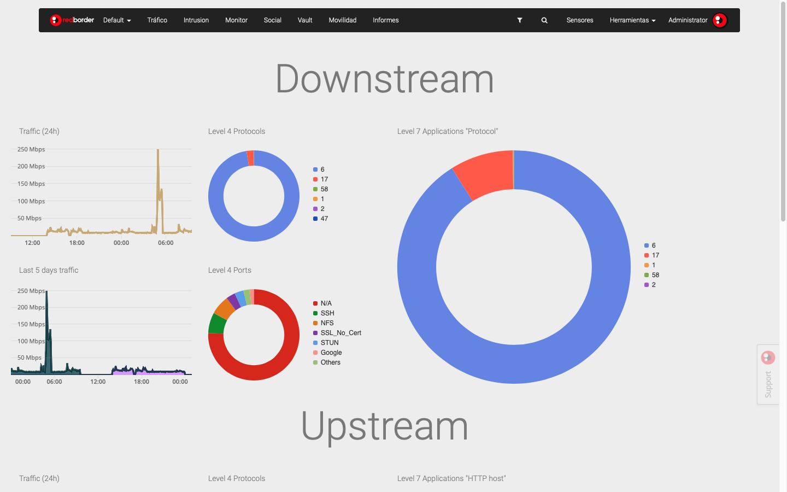
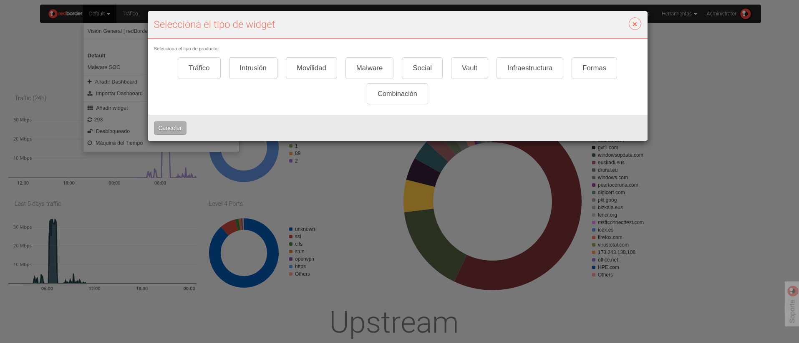
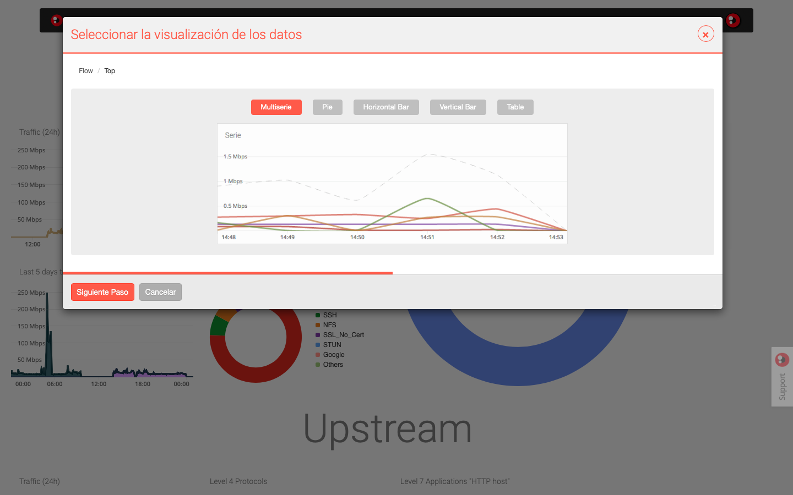
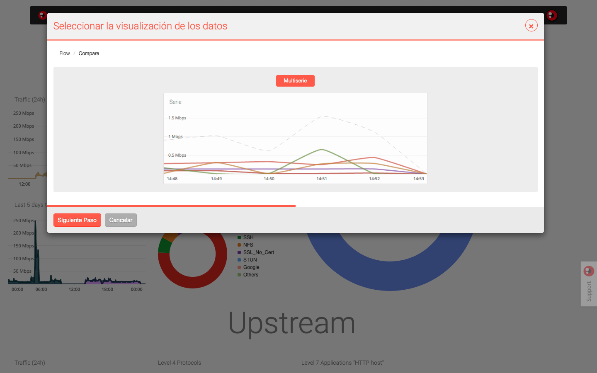
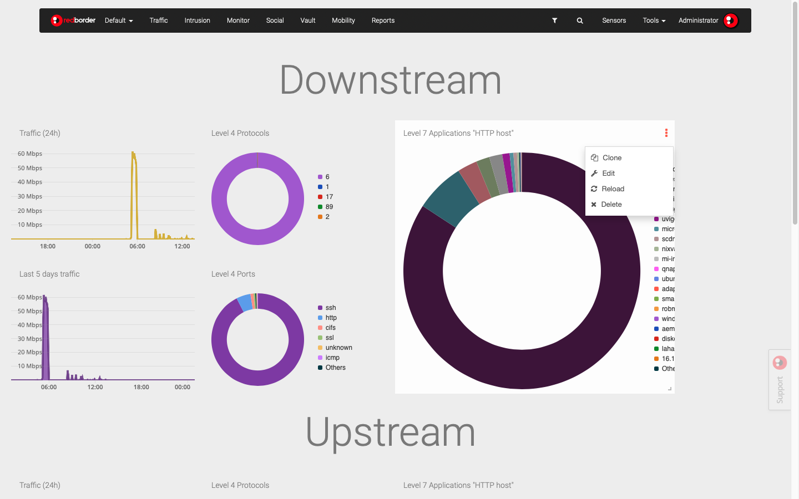

# Dashboards

## Opciones de dashboards

La primera opción que encontramos en la barra de menú en el área de análisis es *Dashboard*. Esta es la opción seleccionada por defecto que verá tan pronto como inicie sesión en el Manager de Redborder.

Vista general del dashboard

La sección de Dashboard presenta diferentes opciones:

- **Lista de dashboards disponibles**: en la parte superior, el usuario verá los dashboards creados y disponibles para su perfil. Junto a cada dashboard, hay dos iconos; el primero (llave inglesa) nos permite ver y editar la configuración general del dashboard. El ícono "Copiar" a la derecha nos permitirá clonar el dashboard seleccionado.
- **Añadir dashboard/Importar dashboard**: permiten añadir un nuevo dashboard personalizado e importar otros ya creados. El proceso de creación e importación del dashboard se verá más adelante.
- **Añadir Widget**: añada los widgets que desea personalizar en el dashboard.
- **URL del dashboard**: da al usuario una manera rápida de copiar el URL del dashboards actual para compartirlo u otros motivos.
- **Tiempo de actualización**: los datos en los dashboards se actualizan cada 300 segundos (5 minutos), este tiempo es personalizable desde *General Settings*. Verá una cuenta regresiva del tiempo restante hasta la próxima actualización. Puede restablecer la cuenta haciendo clic en la figura que se muestra. En ese momento, aparecerá la palabra "Detenido". Haga clic nuevamente para iniciar la cuenta regresiva.
- **Desbloquear**: El usuario tiene la opción de bloquear / desbloquear el dashboard que está consultando para que ningún otro usuario con permisos pueda editar el dashboard.
- **Máquina del tiempo**: permite al usuario ver los resultados de las métricas de un día y hora en particular como si fuese ese su tiempo real.

## Editar dashboard

El usuario puede modificar la información asociada con cada uno de los dashboard disponibles seleccionando "Configuración general", haciendo clic en el icono de la herramienta.

Información editable en la configuración del dashboard:

- Nombre
- Establecer este dashboard por defecto
- Diseño
- Descripción
- Color de fondo
- Usuarios del dashboard: añadir y borrar
- Dominios del dashboard: añadir y borrar

Además, en la parte inferior de la pantalla, el usuario verá una serie de opciones disponibles:

- Actualizar dashboard
- Cancelar
- Borrar
- Convertir en informe
- Exportar dashboard: el sistema creará un archivo comprimido para la descarga; **este es un paso necesario si quieres importar.**

Editar dashboard

## Clonar dashboard

Es posible clonar (duplicar) dashboards para tenerlos disponibles a diferentes usuarios, importaciones, etc. Para ello, simplemente se debe asignar un nombre al panel copiado.

Clonar dashboard

## Añadir dashboard

Los dashboards le permiten tener un resumen visual que incluye los principales KPIs (*Key Performance Indicator*) que son necesarios para analizar la infraestructura de la red. El usuario puede combinar widgets para obtener información valiosa sobre tendencias, cambios y excepciones asociadas al tráfico que ocurre en la red o que pasan por ella.

!!! info "Ten en cuenta..."

    En la versión community, **hay límite de un único dashboard**.

Para crear un nuevo dashboard debe seleccionar la opción **Añadir dashboard**, luego ingresar los datos en la configuración general y guardar los cambios con el botón **Crear dashboard**.

El primer paso para crear un dashboard personalizado es crear un panel en blanco para luego agregar los widgets que satisfagan las necesidades de visualización.

Añadir dashboard

## Importar dashboard

La opción *Importar dashboard* es muy útil para compartirlos con otros usuarios, incorporar información de Redborder de otras aplicaciones compatibles o realizar copias de seguridad para los dashboards creados.

!!! info "Ten en cuenta..."
    Para importar un dashboard, es necesario que este haya sido exportado y guardado localmente como un archivo comprimido.

Seleccione el archivo que desea importar y luego haga clic en la opción "Importar dashboard". Una vez que haya hecho esta importación, encontrará el nuevo dashboard en la lista de dashboards disponibles.

Importar dashboard

## Añadir widget, personalizar dashboards

El usuario puede crear y agregar widgets a sus dashboards para personalizar completamente la visualización de los datos obtenidos por diferentes módulos. Es posible incorporar ambos widgets preconfigurados, así como crear widgets 100% personalizados.

El primer paso es seleccionar el tipo de widget que desea agregar. Existen tres tipos de widgets, según el tipo de información que desea mostrar:

1. **Modulos**: visualización de datos recibida por los diferentes módulos.

    - Tráfico
    - Intrusión
    - Movilidad
    - Malware
    - Vault
    - Wireless
    - Combinación

- **Estado**: mostrar la configuración y el estado de las máquinas y la infraestructura de red.

    - Infraestructura

- **Formato**: configura el contenido y el formato de los widgets: texto, imágenes, URL, etc.

    - Formas

Seleccionar tipo de widget

### Personalización de widgets

- **Widgets preconfigurados**: algunos de los widgets que el usuario puede seleccionar haciendo doble clic contienen información preconfigurada, que se puede agregar al dashboard en el que está trabajando.
- **Widgets semi personalizados**: algunos widgets contienen una cantidad de datos indicados por defecto, sin embargo, el usuario tendrá que completar algunos detalles de información general sobre el widget.
- **Widgets personalizados**: 100% personalizados. Esto significa que el usuario tendrá que definir toda la información contenida en el widget.

Widgets de tráfico

Personalizar widget

#### Personalizar un widget de módulo

Algunos de los widgets que el usuario encuentra disponibles para agregar al dashboard de la plataforma Redborder permiten una personalización completa.

Primero, veamos qué opciones de personalización se incluyen en este tipo de widget.

El primer paso para personalizar un widget es seleccionar el modo de visualización de datos o la cardinalidad, es decir, cómo queremos mostrar los valores o datos en una columna en particular.

!!! info "Ten en cuenta..."
    Los eventos recibidos por el manager consisten en pares **"clave: valor"**. Los valores dados en cada columna pueden entenderse como los propios datos del evento, que en realidad nos pueden proporcionar información.

    El primer paso para personalizar un widget es seleccionar el modo de visualización de los datos, y también puede elegir vistas en las que se representa la cardinalidad.

Opciones de personalización de widgets

**Configurar widgets de acuerdo con las vistas de eventos:**

**Raw**: muestra eventos Raw (sin agregación).

Vista Raw

**Tops**: añade eventos basados en una unidad para mostrar los más destacados de manera que muestra la suma total de datos de diferentes eventos mostrados como uno.

Vista Tops

**Comparar**: comparación en el tiempo (horas, días, semanas y meses) de los más destacados. Un ejemplo de uso sería comparar diferentes días en la evolución del tráfico para una aplicación en particular. A diferencia de la vista Tops, esto solo permite el estilo gráfico "Serie".

Vista Comparar

**Cardinalidad:**

- **Único**: con esta opción, las ocurrencias o eventos de una columna se aíslan en un momento específico.
- **Agrupados**: con esta opción, las ocurrencias o eventos de una columna se aíslan a un tiempo específico agrupado de acuerdo con los criterios determinados.
- **Gráfico**: El usuario puede elegir entre diferentes estilos gráficos disponibles dependiendo de la pantalla seleccionada.
- **Próximo paso**: Luego ingrese la información solicitada en el formulario y presione Crear widget. En este momento, el nuevo widget se agrega a su dashboard.

#### Personalizar un widget de estado

**Infraestructura**: Esta opción le permite seleccionar el modo que mostrará información sobre la configuración y el estado de la infraestructura de red.

1. *Sensor*: Mapa/Árbol
- *Clúster*: Diagrama/Tabla
- *Alarma*: Permite insertar los detalles de configuración en el formulario correspondiente.
- *Info Hardware*: Permite insertar los detalles de configuración en el formulario correspondiente (con respecto al estado de un sensor de dispositivo seleccionado). Muestra información referente al dispositivo (chasis, procesador, pcie).
- *Estado Hardware*: Permite insertar los detalles de configuración en el formulario correspondiente (con respecto al filtro de estado de un sensor de dispositivo seleccionado). Indica si el funcionamiento del dispositivo es el correcto junto con una imágen identificativa del mismo.
- *Monitor*: Serie/Valor.

Widgets de estado

### Widgets de formato

**Formas**: Esta opción le permite editar e insertar elementos auxiliares en sus widgets como texto, imagen, forma de widget e incrustar una URL personalizada.

Widgets de formato

Para ingresar cualquiera de estos elementos a los widgets, simplemente complete el formulario que aparece en cada caso y aplique los cambios con la opción **Crear widget**.

### Widgets de malware

Los widget de tipo Malware se asocian al análisis de eventos Malware ocurridos en cualquier parte de la infraestructura redborder.

Widgets de malware

Pueden resumirse en la siguiente lista:

1. *Score average per hour*: puntuación media de los eventos de malware detectados en las últimas 24 horas.
- *Malware Fast Search*: widget que permite la busqueda de un evento malware por hash, url o ip.
- *Recent Malware*: muestra eventos de malware detectados en las últimas 24 horas.

### Máquina del tiempo

Esta opción vuelve al estado de la máquina durante el día y la hora que haya determinado. El usuario verá los datos como si estuvieran en tiempo real.

Este "viaje en el tiempo" nos ofrece un grado máximo de precisión en el análisis porque puede indicar el minuto exacto que desea consultar.

### Clonar, editar, recargar y eliminar widgets

El usuario puede acceder directamente a los widgets desde el dashboard. En la esquina superior derecha aparece un menú que da acceso directo a las siguientes acciones.:

- **Clonar**: permite duplicar el widget e incorporarlo directamente en el dashboard que el usuario seleccione.
- **Editar**: da acceso a la configuración general del widget para editar los campos que desee.
- **Recargar**: datos actualizados.
- **Eliminar**

!!! warning "Importante"

    Cuando seleccionas la opción Eliminar, el sistema no mostrará un mensaje de confirmación, por lo que debe asegurarse de que desea eliminar ese widget. En caso de que elimine accidentalmente un widget, recuerde que siempre puede ir al "Añadir widget" para reinsertar o duplicar cualquiera de las características similares, y luego editarlo.
