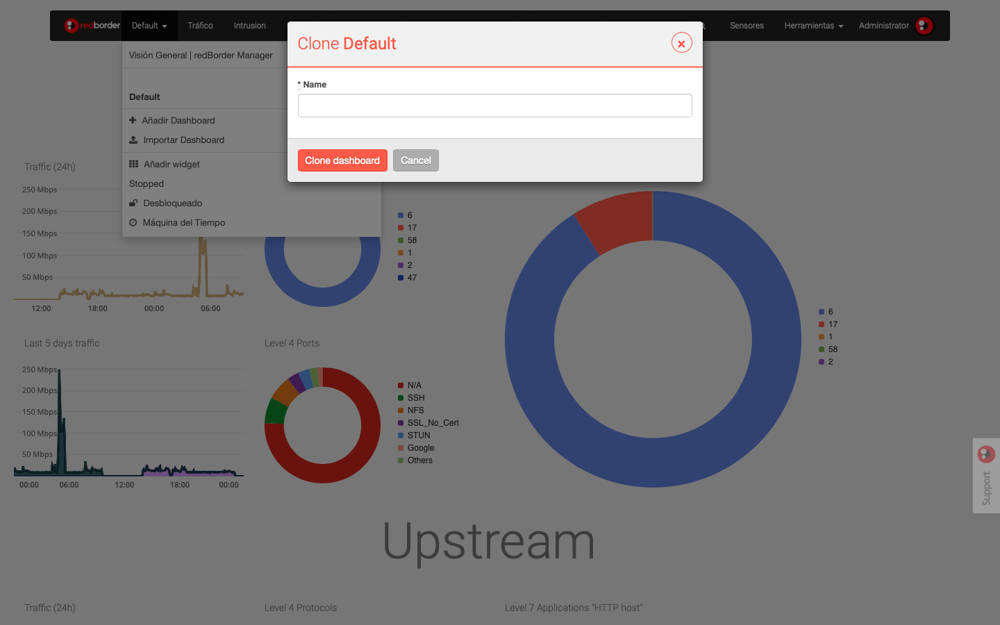
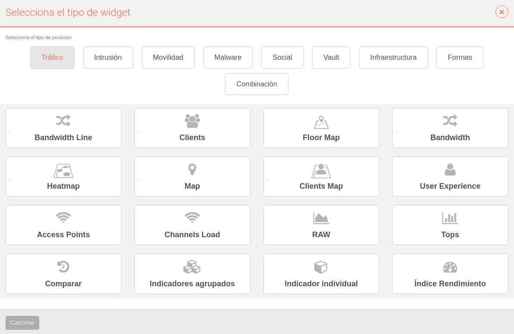
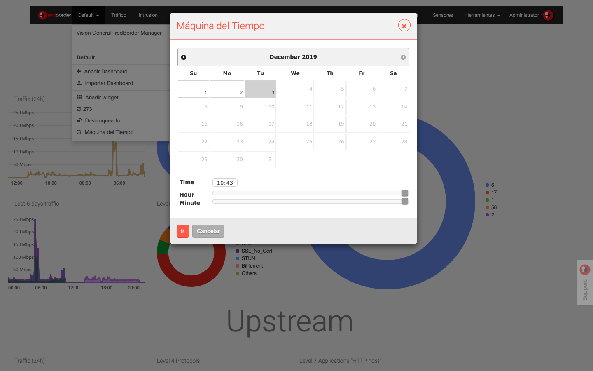

# Dashboards

## Dashboard options

The first option we encounter in the menu bar in the analysis area is *Dashboard*. This is the default option you will see as soon as you log in to the Redborder Manager.

Dashboard Overview

The Dashboard section presents different options:

- **List of Available Dashboards**: At the top, the user will see the created dashboards available for their profile. Next to each dashboard, there are two icons; the first one (wrench) allows us to view and edit the general dashboard settings. The "Copy" icon on the right allows us to clone the selected dashboard.
- **Add Dashboard/Import Dashboard**: allow adding a new custom dashboard and importing others already created. The process of creating and importing the dashboard will be discussed later.
- **Add Widget**: add the widgets you want to customize on the dashboard.
- **Dashboard URL**: give the user a quick way of copying the URL of the current dashboard for sharing or other purposes.
- **Refresh Time**: data on dashboards is refreshed every 300 seconds (5 minutes), this time is customizable from *General Settings*. You will see a countdown of the remaining time until the next update. You can reset the countdown by clicking on the displayed figure. At that moment, the word "Stopped" will appear. Click again to start the countdown.
- **Unlock**: the user has the option to lock/unlock the dashboard they are viewing so that no other user with permissions can edit the dashboard.
- **Time Machine**: allows the user to view metric results from a particular day and time as if it were their real time.

Dashboard Options

## Edit Dashboard

The user can modify the information associated with each of the available dashboards by selecting "General Settings" by clicking on the tool icon.

Editable information in the dashboard settings:

- Name
- Set this dashboard as default
- Layout
- Description
- Background color
- Dashboard users: add and delete
- Dashboard domains: add and delete

Additionally, at the bottom of the screen, the user will see a series of available options:

- Refresh dashboard
- Cancel
- Delete
- Convert to report
- Export dashboard: the system will create a compressed file for download; **this is a necessary step if you want to import it.**

Edit Dashboard

## Clone Dashboard

It is possible to clone (duplicate) dashboards to have them available for different users, imports, etc. To do this, simply assign a name to the copied panel.

Clone Dashboard

## Add Dashboard

Dashboards allow you to have a visual summary that includes the main KPIs (Key Performance Indicators) necessary to analyze network infrastructure. The user can combine widgets to obtain valuable information about trends, changes, and exceptions associated with the traffic occurring in the network or passing through it.

!!! info "Note..."

    In the community version, **there is a limit of a single dashboard**.

To create a new dashboard, select the **Add Dashboard** option, then enter the data in the general configuration and save the changes with the **Create Dashboard** button.

The first step in creating a custom dashboard is to create a blank panel and then add widgets that meet the visualization needs.

Add Dashboard

## Import Dashboard

The *Import Dashboard* option is very useful for sharing them with other users, incorporating information from Redborder from other compatible applications, or making backups for created dashboards.

!!! info "Note..."
    To import a dashboard, it is necessary that it has been exported and saved locally as a compressed file.

Select the file you want to import and then click on the "Import Dashboard" option. Once you have made this import, you will find the new dashboard in the list of available dashboards.

Import Dashboard

## Adding Widgets, Customizing Dashboards

Users can create and add widgets to their dashboards to fully customize the visualization of data obtained from different modules. It's possible to incorporate both preconfigured widgets as well as create 100% custom widgets.

The first step is to select the type of widget you want to add. There are three types of widgets, depending on the type of information you want to display:

1. **Modules**: Visualize data received by different modules.
   - Traffic
   - Intrusion
   - Mobility
   - Malware
   - Vault
   - Wireless
   - Combined 

2. **Status**: Show the configuration and status of machines and network infrastructure.
   - Infrastructure

3. **Format**: Configure the content and format of the widgets: text, images, URL, etc.
   - Forms

Select Widget Type

### Widget Customization

- **Preconfigured Widgets**: Some of the widgets that the user can select by double-clicking contain preconfigured information, which can be added to the dashboard you are working on.
- **Semi-Custom Widgets**: Some widgets contain a default amount of data indicated, however, the user will have to complete some general information details about the widget.
- **Custom Widgets**: 100% customized. This means the user will have to define all the information contained in the widget.

Traffic Widgets

Customize widgets

#### Customizing a Module Widget

Some of the widgets available for adding to the Redborder platform dashboard allow for complete customization.

First, let's see what customization options are included in this type of widget.

The first step in customizing a widget is selecting the data display mode or cardinality, i.e., how we want to display values or data in a particular column.

!!! info "Note..."
    The events received by the manager consist of **"key: value"** pairs. The values given in each column can be understood as the event's own data, which can actually provide us with information.

    The first step in customizing a widget is selecting the data display mode, and you can also choose views in which the cardinality is represented.

Widget Customization Options

**Configuring Widgets According to Event Views:**

**Raw**: Shows Raw events (without aggregation).

Raw View

**Tops**: Adds events based on a unit to display the most prominent ones in a way that shows the total sum of data from different events displayed as one.

Tops View

**Compare**: Time comparison (hours, days, weeks, and months) of the most prominent ones. An example of usage would be comparing different days in the traffic evolution for a particular application. Unlike the Tops view, this only allows the "Series" graph style.

Compare View

**Cardinality**:

- **Unique**: With this option, occurrences or events of a column are isolated at a specific time.
- **Grouped**: With this option, occurrences or events of a column are isolated at a specific time grouped according to the determined criteria.
- **Graph**: The user can choose from different available graph styles depending on the selected screen.
- **Next Step**: Then enter the requested information in the form and press Create widget. At this point, the new widget is added to your dashboard.

#### Customizing a Status Widget

**Infrastructure**: This option allows you to select the mode that will show information about the configuration and status of the network infrastructure.

1. *Sensor*: Map/Tree
2. *Cluster*: Diagram/Table
3. *Alarm*: Allows inserting configuration details in the corresponding form.
4. *Hardware Info*: Allows inserting configuration details in the corresponding form (regarding the status of a selected device sensor). Displays information regarding the device (chassis, processor, pcie).
5. *Hardware Status*: Allows inserting configuration details in the corresponding form (regarding the status filter of a selected device sensor). Indicates if the device's operation is correct along with an identifying image of it.
6. *Monitor*: Series/Value.

### Format Widgets

**Forms**: This option allows you to edit and insert auxiliary elements into your widgets such as text, image, widget shape, and embed a custom URL.

To input any of these elements to the widgets, simply fill out the form that appears in each case and apply the changes with the **Create widget** option.

### Malware Widgets

Malware type widgets are associated with the analysis of Malware events occurring anywhere in the redborder infrastructure.

They can be summarized in the following list:

1. *Score average per hour*: Average score of detected malware events in the last 24 hours.
2. *Malware Fast Search*: Widget allowing the search of a malware event by hash, URL, or IP.
3. *Recent Malware*: Displays malware events detected in the last 24 hours.

### Time Machine

This option takes the machine back to the state during the day and hour you have determined. The user will see the data as if it were real-time.

This "time travel" offers a maximum degree of precision in analysis because you can indicate the exact minute you want to refer to.

### Clone, Edit, Refresh, and Delete Widgets

Users can directly access the widgets from the dashboard. In the top right corner, a menu appears giving direct access to the following actions:

- **Clone**: Allows duplicating the widget and incorporating it directly into the selected dashboard.
- **Edit**: Gives access to the general widget settings to edit the fields you want.
- **Refresh**: Updated data.
- **Delete**

!!! warning "Important"

    When selecting the Delete option, the system will not display a confirmation message, so you must ensure that you want to delete that widget. In case you accidentally delete a widget, remember that you can always go to "Add widget" to reinsert or duplicate any of the similar features, and then edit it.
