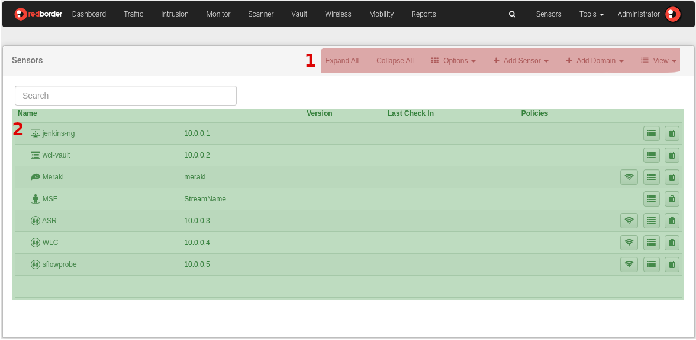
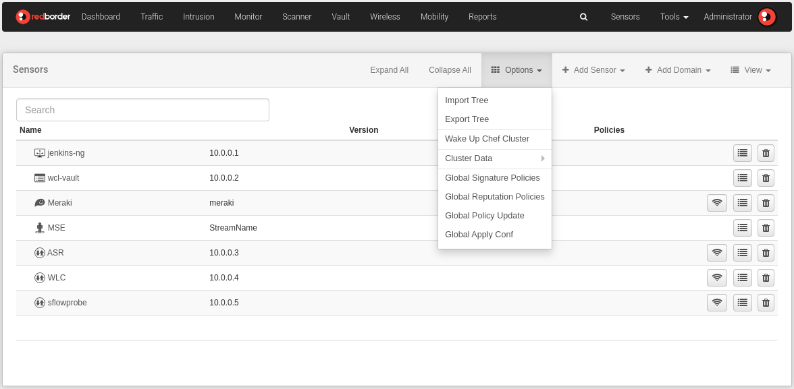
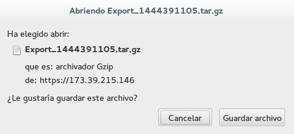
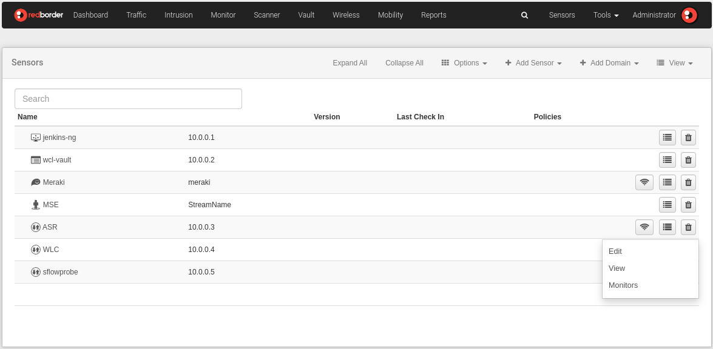
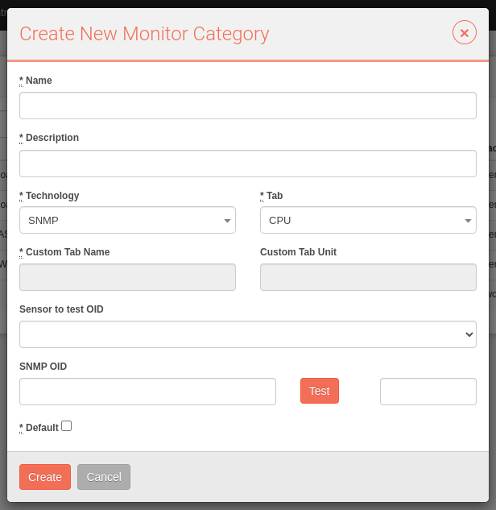
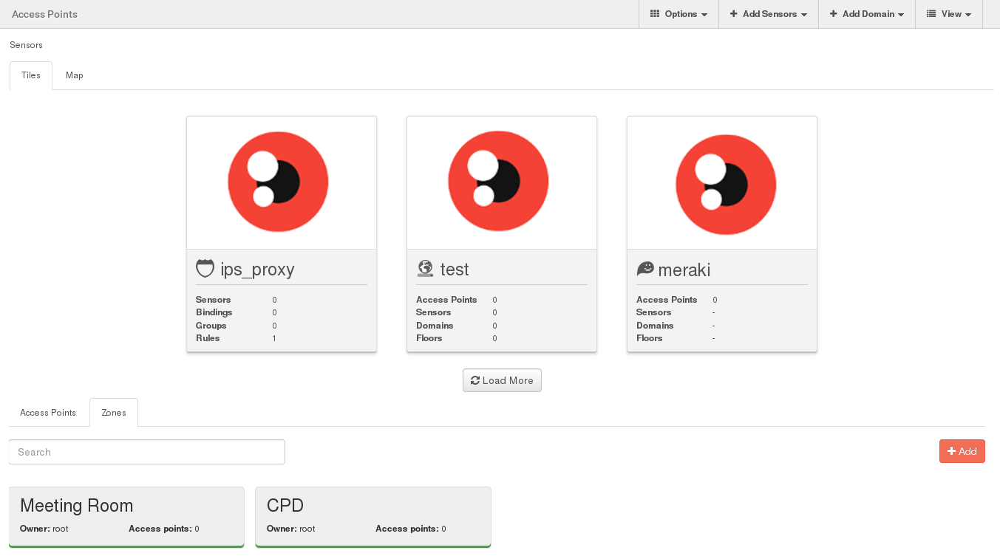
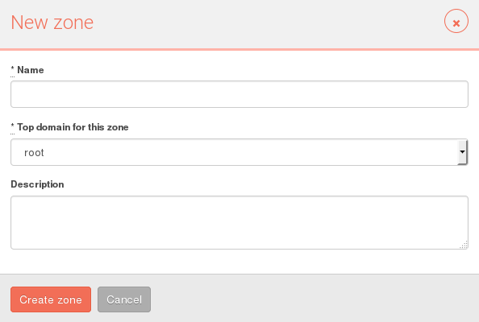

# Sensores

En la sección ***Sensors*** el usuario puede realizar la consulta, gestión y configuración de los sensores registrados en el Manager a través de la creación y edición de dominios y sensores. Para ello, dispone de varias vistas que le ofrecen la posibilidad de realizar diversas acciones sobre los sensores que haya registrado en el Manager.

***Sensors*** se encuentra disponible en el margen superior derecho del menú de cabecera, junto a la sección Tools y la zona de usuario. Este área del menú se llama **Zona de configuración**, porque a diferencia de las opciones disponibles en el margen superior izquierdo (Análisis), estas permiten la administración y configuración completas del Manager y de los sensores: políticas de reglas, alarmas, configuración de clúster o gestión del usuario, entre otras acciones.

## Menú y opciones de los sensores

La organización de esta sección es muy similar, en cuanto a estructura, a la de otras partes de la web. En este caso, encontraremos:

Vista general de sensores

1. **Sección del submenú**: opciones de configuración y gestión de sensores.
    - *Expandir todo*: Expande completamente el árbol de sensores.
    - *Contraer todo*: Contrae completamente el árbol de sensores.
    - *Opciones*
    - *Añadir sensor*
    - *Añadir dominio*
    - *Vista*

- **Área principal**: la información que se muestra en este área dependerá de la vista seleccionada. Existen cuatro vistas disponibles para visualizar la organización de los sensores registrados en el Manager:
    - *Árbol*: listado que muestra la infraestructura de red según niveles de jerarquía y dependencia entre los elementos que la componen. Junto a cada elemento se muestran dos íconos que permiten realizar acciones de edición y borrado de estos.
    - *Mapa*: sitúa la localización de los dominios y sensores sobre un mapa.
    - *Puntos de acceso*: ofrece acceso directo a la visualización de los *Access Points* definidos.

    Sensores en la Vista el usuario puede encontrar una lista de sensores disponibles según las aplicaciones incluidas en su licencia. Haga clic en el sensor que desea verificar para ver una lista alfabética de todos los sensores asociados con esta aplicación.

!!! info "Ten en cuenta..."
    Cada vista presenta su propio menú de opciones y las diferentes posibilidades de creación y edición de sensores o dominios.

    La vista Mapa no presenta opciones disponibles.

## Opciones

Aquí se encuentran las opciones disponibles en la sección Sensores. Pueden ser seleccionadas desde el botón Opciones y desde las opciones que se muestran haciendo click en el botón "Editar" tanto en el nivel de dominio como en el de sensor.

- *Importar Árbol*: Esta opción le permite importar su infraestructura de red mediante la carga de un archivo a la plataforma de Redborder. Esto se mostrará en la vista de árbol.

    

    Importar Árbol

    Hay dos maneras de importar un árbol

    1. **Opciones** -> **Importar árbol**
    - Editar ícono (nivel de dominio)

    

    Importación del Árbol

- *Exportar Árbol*: Esta opción permite exportar un árbol y está al alcance de otras aplicaciones. El usuario descargará un archivo zip para almacenarlo en su computadora.

    Hay dos maneras de exportar un árbol

    1. **Opciones** -> **Exportar árbol**
    - Editar ícono (nivel de dominio)

    

    Exportar Árbol

- *Levantar clúster del Chef*
- *Datos del clúster*
    1. Datos indexados: Muestra estadísticas de datos indexados del clúster
    - Históricos: Muestra información acerca del histórico de datos del clúster
    - Realtime: Muestra información acerca del proceso Realtime

## Añadir sensor

A lo largo de las opciones del submenú encontramos **Añadir un Sensor**. En el menú desplegable, muestran los diferentes sensores disponibles para agregar a la infraestructura de red.

Seleccione el tipo de sensor en el menú desplegable y luego complete la información solicitada.

También es posible reclamar un sensor desde un proxy remoto utilizando la opción en el menú desplegable e ingresando el UUID del sensor.

Añadir sensor

!!! info "Ten en cuenta..."

    En el momento en que se crea un sensor, por defecto se establece como raíz, por encima del nivel de dominio.
    
    El usuario puede organizar su infraestructura de sensores en cualquier momento, arrastrando y soltando el sensor en el nivel en el que desea colocarlo.
    
    El sensor hereda automáticamente las propiedades del dominio raíz. (políticas, modo de funcionamiento, variables de Snort, etc.).

## Vistas

Cuando el usuario accede a la sección Sensores puede encontrar una lista (vista de árbol) en la que se muestran los dominios y sensores que forman parte de su infraestructura de red. En este punto vamos a revisar cada vista y las acciones disponibles.

Opciones del menú Vistas

### Árbol

La vista **árbol** (Visualizada en la imagen anterior) es la que se muestra por defecto al acceder a **Sensores**. En ella se visualiza un listado en el que se muestra la organización de dominios y sensores según niveles de jerarquía y dependencia.

Desde esta vista el usuario puede añadir un nuevo dominio o sensor, borrar los existentes, acceder a otras vistas, importar y exportar el arbol así como editar directamente todos los dominios y sensores que son parte del listado.

Cada elemento que se muestra en el arbol tiene dos iconos: Editar y borrar. (Los mismos iconos funcionan en la vista árbol y en la vista sensor):

Íconos "Editar" y "Eliminar"

!!! info "Ten en cuenta..."
    Las opciones del menú desplegado por el icono Editar variarán dependiendo de que si nos encontramos a nivel de dominio o sensores.

!!! warning "Importante"

    **Algunos sensores no pueden ser eliminados.**

    En estos casos, el icono "Eliminar" aparecerá en color gris. Antes de que se elimine el dominio o el sensor, el sistema le mostrará una pantalla emergente con un mensaje de advertencia.

    Todos los usuarios y descendientes asignados a este dominio o sensor serán deshabilitados y asignados a los padres de este dominio o dominio raíz. El usuario con rol de administrador debe activar los permisos del usuario desde la sección *Herramientas -> Usuarios*.

Confirmar eliminación de sensor

En caso de que se hayan registrado **sensores IPS/IDS** se mostrará el tipo de política/s que se le hayan aplicado.

Al hacer clic sobre él accedemos al panel de reglas incluidas en esa política. Para más información consulte el capítulo 8 "**Creación de políticas**".

Ícono Políticas

**Opciones disponibles en la vista de Árbol:**

- Añadir un nuevo dominio o sensor
- Eliminar un dominio o sensor
- Acceder a otras vistas
- Importar y Exportar el árbol
- Editar un domninio o sensor

#### Niveles de organización

- **Dominio**: se trata de contenedores que pueden incluir sensores, grupos de sensores, etc. El nivel dominio nos muestra el nombre del dominio y nos permite agregar una descripción. Es posible clasificarlos según su naturaleza (organizacional, espacial, etc.)

- **Sensores**: nodos finales que se corresponden con elementos físicos colocados en la red (switches, routers, IPS, etc.).
A nivel de sensores se muestra la siguiente información: nombre del sensor, IP, política aplicada (sensores IPS), último chequeo y versión. Es posible añadir una descripción al sensor.

!!! info "Ten en cuenta..."
    Recuerde que la creación de los sensores IPS o Gateway se debe realizar a través del registro de los sensores en el proceso de instalación del Manager. Sensors le permite editar y sobreescribir los parámetros que hayan heredado de la Configuración General: **Herramientas -> Configuración general**

    Los sensores del resto de Apps pueden crearse desde la sección **Sensores**.

**Herencia de configuración**:

En la sección **Herramientas** encontramos opciones de Configuración General a través de los cuales el usuario puede definir parámetros generales del Manager y de las Apps.

Este es el máximo nivel de configuración (actua como dominio root) por lo tanto, las propiedades definidas aquí serán heredadas por dominios y sensores que caen por debajo de este nivel.

Cuando se crea un dominio o sensor o se edita por primera vez, podemos observar que algunos parámetros tienen la etiqueta "Heredado", lo que significa que han heredado los valores de la Configuración general. Sobrescriba esta información en caso de que quiera cambiarla.

Los dominios y sensores que caen por debajo del nivel del elemento sobrescrito, heredan nuevamente las propiedades aplicadas a este elemento.

#### Monitores

!!! info "Ten en cuenta..."
    Esta opción solo se encuentra disponible en el menú desplegado por el icono "Editar" a nivel de sensor.

Al hacer clic sobre icono del icono "Editar" sensor, aparece la opción Monitor. Luego, podemos ver una lista con las métricas de monitoreo que se utilizan para monitorear el estado del sensor en diferentes niveles. La columna de tecnología indica el origen desde donde se recopilan los datos.

Menú de edición de sensor

Estas son las acciones disponible para el control del estado del sensor:

- **Restaurar predeterminado**: aplica las métricas predeterminadas que se incluyen en el momento de creación de los sensores.
- **Añadir monitor**: muestra las métricas disponibles.
- **Eliminar monitor**: elimina la métrica aplicada.

Monitores

Añadir categoría de monitor

### Puntos de acceso

Los Puntos de Acceso (AP) son los puntos de acceso de la infraestructura de red que están asociados a una localización. Los *Access Points* dependen de la App Flow y aplican tanto a nivel de dominio como de sensores.

Este es otro modo de visualizar su organización de sensores, a través de la distribución de los AP por dominio. Se puede acceder a la visualización o creación de los Puntos de Acceso de dos maneras distintas:

- Vista -> Puntos de Acceso.
- Icono editar a nivel de sensor/dominio -> Editar: Vista Puntos de Acceso (situado en el submenú superior derecha).

!!! info "Ten en cuenta..."
    Para saber a qué nivel nos encontramos, puede consultar la ruta de navegación situada en el margen superior izquierdo. Puede navegar por las diferentes pantallas haciendo clic sobre alguno de los elementos de la ruta.

El submenú de esta interfaz muestra una serie de botones similares a los de la pantalla principal de **Sensors**. Las acciones que puede realizar desde esta pantalla son las siguientes (estas pueden variar según si se está consultando a nivel de dominio o sensor):

- **Mostrar en Mapa/Mostrar Plantas**: muestra la distribución geográfica de los Puntos de Acceso o su localización en plantas en el caso en el que estemos consultando un dominio Planta con más de un nivel de planta.
- **Editar (nombre del dominio o sensor)**: nos devuelve a la pantalla de edición del dominio o sensor.
- **Opciones -> Exportar Puntos de Acceso/Borrar Puntos de Acceso**: permite exportar todos los Access Points a un archivo .csv o eliminar todos los Puntos de Acceso definidos para esa localización.
- **Añadir sensores**: añade un nuevo sensor que se define como como un Punto de Acceso.
- **Añadir dominio**
- **Vistas**: menú que permite navegar a través de las diferentes vistas existentes.
- **Añadir Puntos de Acceso**
- **Añadir zonas**

Resumen de Puntos de Acceso

Añadir Punto de Acceso

Puntos de Acceso (Zona)

Añadir Zona

## Añadir un dominio

Como hemos visto anteriormente, existen diversos tipos de dominios identificados a través de un icono en la vista de árbol. El proceso de adición de un dominio es muy sencillo; la configuración deberá realizarse posteriormente mediante el icono Editar -> Edit que encontramos al lado de cada dominio en la vista árbol o desde la vista **Access Points**.

Seleccionar la opción *Add Domain* que se encuentra en el submenú superior derecha, elegir el tipo de dominio que se quiere añadir, y a continuación, rellenar los campos requeridos (estos variarán según el tipo de dominio a crear).

Añadir un dominio

A partir de este momento, el resto de información asociada al dominio deberá modificarse haciendo clic en el botón de edición situado a la derecha de cada dominio en la vista Árbol o Access Points y seleccionando la opción *Edit*.

## Editar un dominio

Desde esta interfaz puede modificar la configuración de un dominio existente e ingresar la información de un dominio recién creado.

Para acceder a esta pantalla, el usuario debe hacer clic en el botón editar a la derecha del dominio que desea editar desde la vista de árbol o Puntos de acceso y selecciona la opción **Editar**.

Edición de un dominio

Estos son los datos generales que podemos modificar para los dominios. Sin embargo, dependiendo del tipo de dominio seleccionado, aparecerá uno de estos campos:

- **General**: Muestra información general del dominio. Nombre , tipo de dominio: (seleccione el tipo de dominio en el cuadro) y descripción.
- **Servidores**: En esta sección, el usuario puede definir la configuración de los servidores Proxy y Syslog. Todos los valores mostrados se heredan de forma predeterminada. Sobreescribe si es necesario.
- **Localización**: Localiza el sensor/dominio en un mapa mundial.
