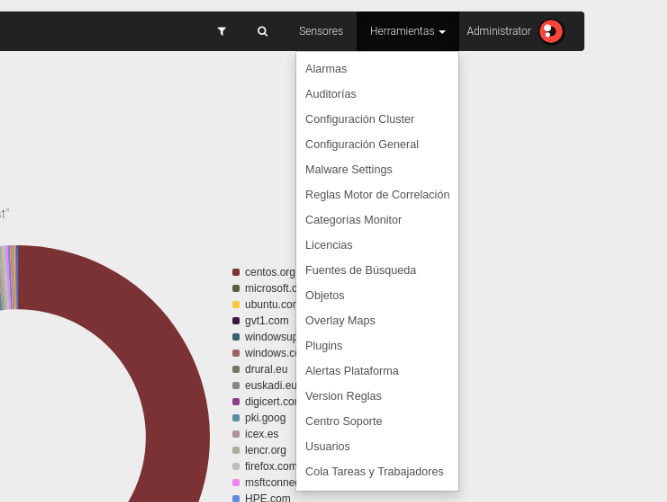

# Herramientas y administración

En el área de configuración de la barra de menú, cerca de Sensores podemos encontrar la sección Herramientas donde puede encontrar las opciones para la configuración de la plataforma Redborder.

Herramientas: opciones disponibles para configurar la plataforma Redborder

Desde este menú puede establecer las condiciones que deben cumplirse para que el usuario sea notificado por una alarma, realizar un seguimiento de las actividades de los usuarios de la plataforma, registrar nuevos usuarios o gestionar la configuración del clúster, sensores y servidores, entre otras muchas más acciones.

Veamos una descripción de las opciones que se encuentran en el menú de herramientas:

## Alarmas

Una alarma es una notificación que se activa cuando el usuario cumple una o más condiciones.

Al acceder a esta opción, se muestra la lista de alarmas que se han registrado.

Lista de alarmas activas

### Crear una nueva alarma

Haciendo click en el botón **Nueva Alarma** accedemos al formulario, en el que se establecerán las condiciones que debe cumplir la alarma para activar una notificación, y el grado de gravedad definido para esa alarma.

Crear una alarma nueva

1. Configuración General

    - **Nombre**: nombre de la alarma.
    - **Ventana de tiempo**: intervalo de tiempo que debe superarse por exceso o valores predeterminados dados en límite superior / inferior para que la alarma esté activa.
    - **Tipo de producto**: seleccione el tipo de aplicación / elemento para el que se ha definido la alarma. El usuario verá en este campo las opciones que se incluyen en su licencia.
    - **Notificar cada**: establece la secuencia de tiempo para notificación.
    - **Límites superior / inferior**: indica el número de eventos (máximo / mínimo) que deben cumplir las condiciones de la alarma para activar la notificación.
    - **Unidad**: agregación deseada para la alarma. Variará dependiendo de las agregaciones disponibles en el tipo de producto deseado.
    - **Zona horaria**: permite elegir qué definición de tiempo se quiere utilizar para la alarma.
    - **Gravedad**: el usuario debe definir el nivel de gravedad que se le da a la alarma. Dependiendo de las condiciones que haya definido para la alarma, implicará un riesgo muy bajo, bajo, medio, alto, muy alto o crítico. Esta gradación de gravedad también se indica en una escala de colores.

- Anomalías

    RedBorder utiliza técnicas de análisis de datos para proveer notificaciones de peligros potenciales, esta opción permite al usuario configurar alarmas inteligentes que serán disparadas dependiendo de si se detecta alguna anomalía de red dentro de los filtros especificados en el apartado *Condiciones*.

    Activar esta opción hará que se realice un análisis de anomalías una vez pasada la **Ventana de tiempo** configurada en la *Configuración General* de la alarma.

    - **Granularidad**: indica el grado de detalle temporal que utilizará la alarma para analizar los datos.

- Notificaciones

    - A *Syslog*: marque esto para exportar las notificaciones a un servidor syslog externo.
    - Por *Email*: marque esto para seleccionar usuarios a los que enviar las notificaciones y que reciban un correo electrónico cuando se active una alarma.
    - A *Slack*: marque esto para habilitar el campo *Slack Webhook* que permite a la plataforma enviar un mensaje a un canal de Slack cuando se active una alarma.

- Condiciones

    Son los filtros en los que se va a basar el disparado de la alarma. Pueden ser configurados de manera similar a como se configurarían en el tipo de aplicación / elemento para el que se ha definido la alarma.
