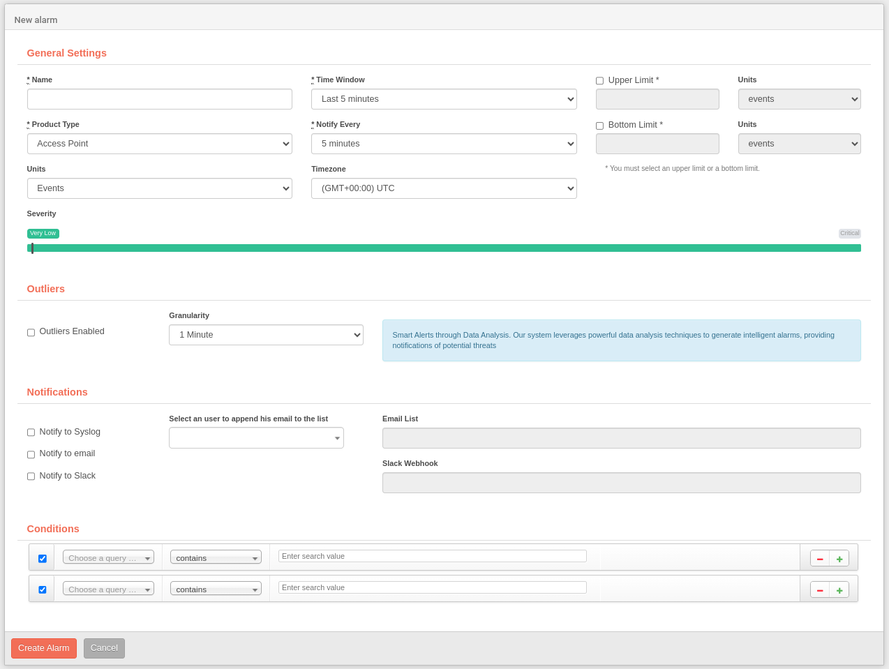
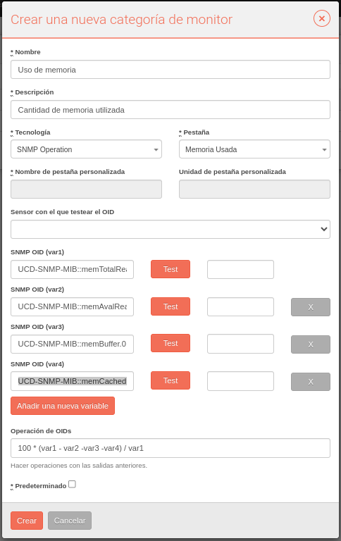

# Herramientas y administración

En el área de configuración de la barra de menú, cerca de Sensores podemos encontrar la sección Herramientas donde puede encontrar las opciones para la configuración de la plataforma Redborder.

Herramientas: opciones disponibles para configurar la plataforma Redborder

Desde este menú puede establecer las condiciones que deben cumplirse para que el usuario sea notificado por una alarma, realizar un seguimiento de las actividades de los usuarios de la plataforma, registrar nuevos usuarios o gestionar la configuración del clúster, sensores y servidores, entre otras muchas más acciones.

Veamos una descripción de las opciones que se encuentran en el menú de herramientas:

## Alarmas

Una alarma es una notificación que se activa cuando el usuario cumple una o más condiciones.

Al acceder a esta opción, se muestra la lista de alarmas que se han registrado.

Lista de alarmas activas

### Crear una nueva alarma

Haciendo click en el botón **Nueva Alarma** accedemos al formulario, en el que se establecerán las condiciones que debe cumplir la alarma para activar una notificación, y el grado de gravedad definido para esa alarma.

Crear una alarma nueva

1. Configuración General

    - **Nombre**: nombre de la alarma.
    - **Ventana de tiempo**: intervalo de tiempo que debe superarse por exceso o valores predeterminados dados en límite superior / inferior para que la alarma esté activa.
    - **Tipo de producto**: seleccione el tipo de aplicación / elemento para el que se ha definido la alarma. El usuario verá en este campo las opciones que se incluyen en su licencia.
    - **Notificar cada**: establece la secuencia de tiempo para notificación.
    - **Límites superior / inferior**: indica el número de eventos (máximo / mínimo) que deben cumplir las condiciones de la alarma para activar la notificación.
    - **Unidad**: agregación deseada para la alarma. Variará dependiendo de las agregaciones disponibles en el tipo de producto deseado.
    - **Zona horaria**: permite elegir qué definición de tiempo se quiere utilizar para la alarma.
    - **Gravedad**: el usuario debe definir el nivel de gravedad que se le da a la alarma. Dependiendo de las condiciones que haya definido para la alarma, implicará un riesgo muy bajo, bajo, medio, alto, muy alto o crítico. Esta gradación de gravedad también se indica en una escala de colores.

- Anomalías

    RedBorder utiliza técnicas de análisis de datos para proveer notificaciones de peligros potenciales, esta opción permite al usuario configurar alarmas inteligentes que serán disparadas dependiendo de si se detecta alguna anomalía de red dentro de los filtros especificados en el apartado *Condiciones*.

    Activar esta opción hará que se realice un análisis de anomalías una vez pasada la **Ventana de tiempo** configurada en la *Configuración General* de la alarma.

    - **Granularidad**: indica el grado de detalle temporal que utilizará la alarma para analizar los datos.

- Notificaciones

    - A *Syslog*: marque esto para exportar las notificaciones a un servidor syslog externo.
    - Por *Email*: marque esto para seleccionar usuarios a los que enviar las notificaciones y que reciban un correo electrónico cuando se active una alarma.
    - A *Slack*: marque esto para habilitar el campo *Slack Webhook* que permite a la plataforma enviar un mensaje a un canal de Slack cuando se active una alarma.

- Condiciones

    Son los filtros en los que se va a basar el disparado de la alarma. Pueden ser configurados de manera similar a como se configurarían en el tipo de aplicación / elemento para el que se ha definido la alarma.

## Auditorías

Esta opción muestra una lista de la actividad del usuario (o usuarios) registrada en la plataforma Redborder, ordenada cronológicamente de manera predeterminada. El usuario puede ordenar la tabla de forma ascendente o descendente para cada una de las columnas. Puede usar el cuadro de búsqueda ubicado en la parte superior para filtrar la información que desea ver. Las columnas que se muestran en esta tabla son las siguientes:

- Usuario: usuario que realizó la acción
- Recurso: elemento que se ha creado, modificado o eliminado.
- Acción: acción que se ha llevado a cabo (creación, edición, eliminación).
- Mensaje: breve descripción de lo que ha sido auditado.
- Timestamp: fecha y hora del registro de actividad.

Auditorias: registro de actividad del usuario

## Configuración del clúster

La opción Configuración del clúster nos permite verificar el estado y la configuración del clúster, establecer el proceso de creación del clúster durante el proceso de instalación del Manager.

Puede modificar estos valores editando a través del botón de desbloqueo  Desbloquear. La información se puede cambiar con los siguientes parámetros:

- Estado del clúster
- Direcciones IP virtuales
- Histórico de Nodos
- Histórico de Reglas

Configuración del clúster: Estado y configuración del clúster

## Reglas del motor de correlación

Aquí el uso puede ver todas las reglas para el motor de correlación. Es posible editar las reglas existentes y también crear otras nuevas.

## Categorías de monitores

Aquí podemos agregar una nueva categoría para monitorizar el hardware. Las categorías utilizan tecnologías como SNMP, Redfish o IPMI para proporcionar información sobre el sistema y su funcionamiento.

Categorías de Monitor

Para agregar una nueva categoría de monitor debemos usar el botón superior derecho. Luego rellenaremos los campos seleccionando la tecnología correcta que permita a Redborder recibir los datos.

Monitor de infraestructura

## Operaciones SNMP

Para explicar la operación de la función snmp usaremos un ejemplo, monitorear el uso de memoria. Cuando creamos una nueva categoría de monitor con el botón Nueva categoría de monitor de la página Categorías de monitor, veremos la siguiente ventana emergente.

Creación inicial de una categoría de monitor

Esta es la fórmula para calcular el uso de memoria de un dispositivo:

    100*(memory_total-memory_free-memory_total_buffer-memory_total_cache)/memory_total

El resultado es una combinación de diferentes valores snmp. Ahora, si queremos crear un monitor como el de este ejemplo, debemos elegir *Operación SNMP* en el menú desplegable de tecnología.

Debajo del campo OID, ahora hay un botón llamado Añadir nueva variable, que agrega otro campo para que podamos ingresar más OID snmp. Las OID's que se usaron son:

    UCD-SNMP-MIB::memTotalReal.0
    UCD-SNMP-MIB::memAvalReal.0
    UCD-SNMP-MIB::memBuffer.0
    UCD-SNMP-MIB::memCached.0

En la parte inferior, hay un campo Operación de OID, en el que presentaremos la operación que queremos hacer con los OID ingresados previamente.

Monitor de ejemplo

Para cada OID, la salida se almacenará en una variable que luego usaremos en la operación de OID.

Una vez en este punto, solo tenemos que crear el monitor presionando el botón *Crear*.

Para agregar el nuevo monitor a un dispositivo sensor, crearemos un nuevo sensor en la pestaña Sensor, seleccionando *Monitor Device*.
