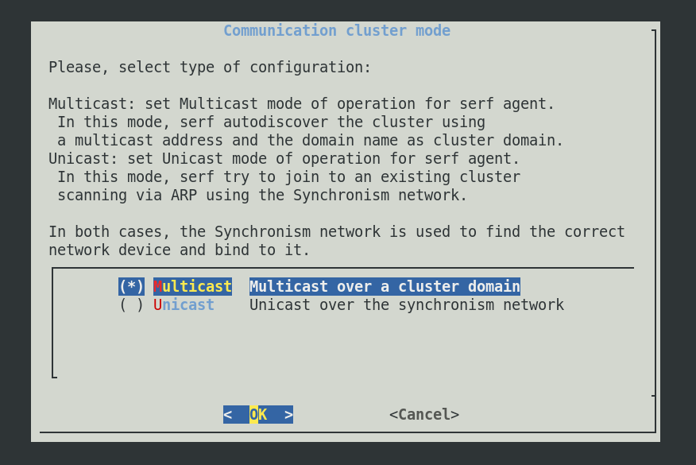
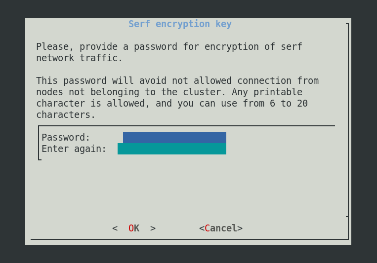

# Instalación del manager de RedBorder

Bienvenido al proceso de instalación de RedBorder. Gracias a esta guía, cualquiera puede preparar la plataforma **sin tener conocimientos específicos de programación en Linux**.

Instalar el Manager de RedBorder es el primer paso para empezar a monitorizar y proteger la información de su red gracias a la solución de RedBorder. Debe verificar el contenido de este capítulo antes de comenzar la instalación de la plataforma (también conocido como el Manager de RedBorder).

!!! tip "Se recomienda..."
    Tener un conocimiento mínimo de la red, así como sobre conceptos básicos de redes.

## Requisitos de la instalación

!!! info "Ten en cuenta..."
    Los siguientes requisitos están relacionados con la instalación de **un solo nodo con uso de ligero a moderado**. Tenga en cuenta que si ejecuta la plataforma en un entorno virtual, es **posible que disminuya el rendimiento** en comparación con una implementación en una máquina física.

La implementación exitosa de RedBorder requiere una máquina con el sistema operativo **Rocky Linux 9** instalado. Los requisitos de hardware de la máquina deben ser como mínimo:

=== "Manager"

    * Disco: 80 GB
    * RAM: 16 GB
    * CPU: 4 núcleos
    * Interfaz de red: Al menos una para un manager solitario. Al menos dos para un manager en cluster.

## Proceso de instalación

La primera acción para comenzar a monitorizar tu red con RedBorder es obtener los paquetes oficiales más recientes de redBorder para **Rocky Linux 9** disponibles en [repo.redborder.com](https://repo.redborder.com).

``` bash title="Latest"
yum install epel-release && rpm -ivh https://repo.redborder.com/ng/latest/rhel/9/x86_64/redborder-repo-1.0.0-1.el9.rb.noarch.rpm
```

``` bash title="Manager"
yum install redborder-manager
```

Ya con los paquetes descargados e instalados, el siguiente paso es configurar RedBorder, para ello cerramos la sesión en consola y volvemos a iniciarla, esto actualizará las rutas a los scripts y así podremos ejecutar el comando:

    rb_setup_wizard

El cual iniciará el **asistente de instalación** de la plataforma en consola para funcionar como guía durante todo el proceso.

### Configuración de red

En el recuadro inferior se listan las interfaces de red existentes en el equipo en cuestión. Debajo de todas las interfaces que posee el equipo, está la opción `Finalize`, que podemos seleccionar **después de haber configurado** exitosamente las interfaces.


Configuración de red

Al seleccionar una interfaz y entrar en ella, se nos da la opción de configurarla con una dirección IP estática o que esta funcione dinámicamente (con DHCP).


Configuración de interfaz de red

En caso de seleccionar la opción de IP estática, se deberá especificar la IP, la máscara de red y la puerta de enlace por defecto:


Configuración de interfaz estática

### Configuración de DNS

El asistente de instalación te dará la opción de elegir si quieres o no configurar servidores DNS. Si se desea configurar un DNS.

Es obligatorio configurar al menos un servidor, sin embargo, actualmente es posible configurar hasta 3 servidores DNS en la plataforma. Esto se puede hacer en la siguiente pantalla:


Configuración de DNS

### Nombre de host y dominio

Durante la instalación, se da la opción de decidir cuál será el nombre de host para el nodo de RedBorder, así como también el dominio utilizado para la comunicación con posibles servidores Proxy de RedBorder o IPS de RedBorder.

El nombre de host a escoger debe respetar el estandar **RFC1123**.

!!! info "Ten en cuenta..."
    El asistente de instalación genera automáticamente un nombre de host aleatorio para la máquina, así como también indica un nombre de dominio por defecto, que se recomienda no cambiar a menos que sea necesario.


Configuración de hostname y dominio

### Configuración de servicio de clústeres (Serf)

RedBorder tiene la capacidad de trabajar de manera distribuida, repartiendo funciones o carga de trabajo entre dos o más nodos, a través de una red de sincronismo que permite a los nodos comunicarse y operar, para ello, empleamos **Serf**(1), es este servicio el que se encarga de crear el cluster de managers y definir los roles de los nodos.
{ .annotate }

1. Serf es una solución descentralizada para descubrimiento y orquestación de servicios que es ligera, altamente disponible y tolerante a fallos.

Para que Serf funcione correctamente, son necesarios tres parámetros:

- Red de sincronismo


- Indicar el modo de Serf (Unicast / Multicast)



- Clave secreta para encriptar el tráfico de red de Serf



### Almacenamiento con Amazon S3 (WIP)

Cuando se realiza una instalación remota de RedBorder en AWS, es posible también utilizar el servicio de almacenamiento remoto de Amazon con S3.

### Base de datos externa (WIP)

Es posible también, configurar RedBorder para utilizar el servicio de Amazon RDS o alguna otra base de dados de PostgreSQL.

### Seleccionar el modo del manager

Dependiendo de cómo sea la instalación de RedBorder que se quiera realizar, se puede indicar a la plataforma qué es lo que se debe ejecutar en el nodo en instalación. El caso más común será la instalación de un único manager en la red, para esto se debe elegir el modo `full`, esto indicará a la plataforma que debe ejecutar todos los servicios en el máquina en cuestión.

!!! info "Ten en cuenta..."
    Si se instalará un cluster de managers, se debe elegir que uno de los nodos trabaje en modo `core` mientras que los otros nodos deben operar en el modo `custom` y seleccionar qué servicios mantendrán.


Elección de modo de manager
