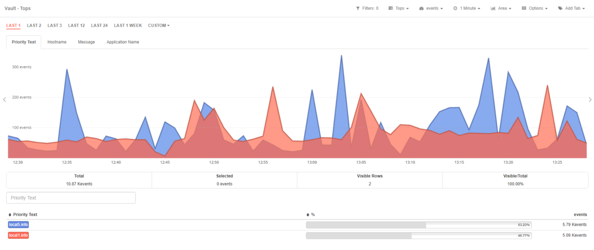
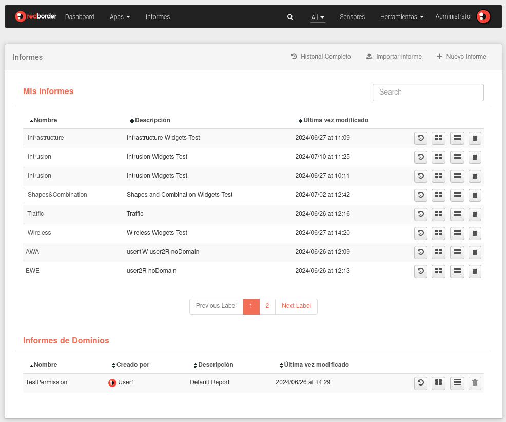
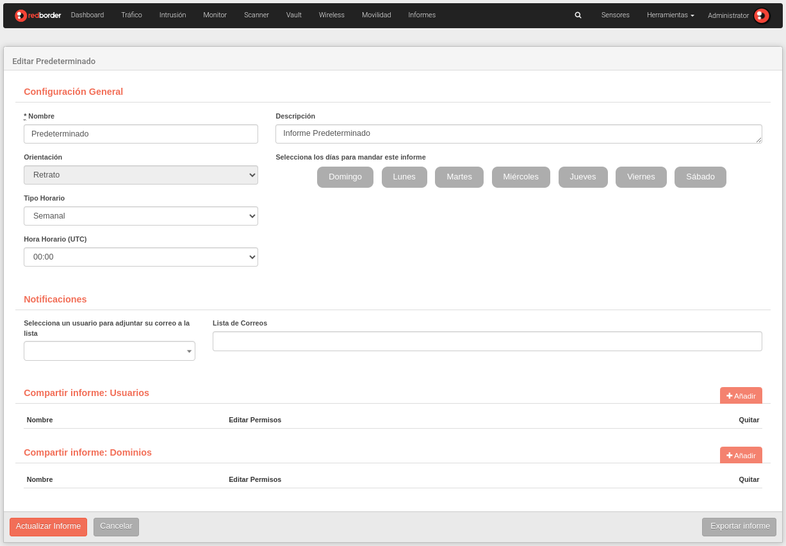

# Módulos

En la **Sección de Eventos** el usuario puede **mostrar, analizar y gestionar** los eventos recolectados por los sensores.

Redborder ofrece la máxima visibilidad de red gracias a las muchas opciones de representación y visualización de datos que nuestras Apps proveen.

La plataforma tiene un módulo para cada funcionalidad. Cada una utiliza diferentes tecnologías y tiene una interfaz independiente. Todos los módulos necesitan un sensor que le provea de datos.

## Business Intelligence

El módulo **Business Intelligence** utiliza la información de clientes a través de los sensores BI. Puede ser usado para obtener las respuestas de los cuestionarios definidos en la plataforma **[RBMobility](https://rbmobility.redborder.com)**.

Este módulo viene desactivado por defecto, para activarlo ejecute el siguiente comando desde la consola:

    rb_set_modules bi:1; chef_client

Módulo de BI

## Malware (WIP)

El módulo **Malware** es una solución completa para la detección de archivos, direcciones IP y direcciones URL maliciosas. Para ello se emplean múltiples motores de detección y servicios de reputación que van más allá de las políticas basadas en firmas y técnicas similares.

Este módulo viene desactivado por defecto, para activarlo ejecute el siguiente comando desde la consola:

    rb_set_modules malware:1; rb_set_malware_mode enable logstash; chef_client

Módulo de Malware

## Tráfico

El módulo **Tráfico** utiliza netflow para extraer información sobre todo el tráfico del sensor. El módulo provee información como IPs, protocolos, localizaciones y mucho más.

Módulo de Tráfico

## Intrusion

El módulo **Intrusión** utiliza datos del sensor o sensores IPS para mostrar eventos de intrusión basados en reglas de Snort. También, gracias a las diferentes vistas que incluye RedBorder, es posible analizar los paquetes que coincidieron con la especificación de la regla.

Módulo de Intrusión

## Monitor

El módulo **Monitor** utiliza datos provenientes de protocolos SNMP, Redfish e Ipmi para mostrar el estado de la infraestructura.

Módulo de Monitor

## Vault

El módulo **Vault** utiliza datos de syslog para proveer información sobre eventos de diferentes orígenes, tales como categoría, objetivo, acción del evento y más.

También es posible aumentar las capacidades del módulo Vault a través de las extensiones que añaden compatibilidades con otros fabricantes.

Módulo de Vault

## Movilidad

El módulo **Movilidad** provee información de localización de sensores de APs de la red. Puede ser usado para mostrar como las personas se mueven en un edificio.

Módulo de Movilidad

## Wireless

El módulo **Wireless** proporciona un análisis de los datos de los visitantes de sensores APs de la red **sin tener en cuenta el cálculo de movimientos**.

Este módulo viene desactivado por defecto, para activarlo ejecute el siguiente comando desde la consola:

    rb_set_modules wireless:1; chef_client

Módulo de Wireless

## Reportes

El módulo de **Reportes** permite al usuario tener informes periódicos con información sobre la plataforma Redborder.

Listado de reportes

Para crear un nuevo informe haremos clic en el botón *Nuevo informe* y rellenaremos todos los campos. También es posible importar un informe desde un archivo usando el botón Importar informe.

Dentro de la creación del nuevo informe podemos seleccionar parámetros como tipo de programación, compartir usuarios o compartir dominios. Una vez que se crea el informe, se mostrará en la lista de informes vista anteriormente.

Edición y creación de reportes

En la lista de informes tenemos la posibilidad de editar un informe existente, generarlo en PDF o enviarlo por correo electrónico, todas estas opciones están en el botón de edición a la derecha de la lista.

Los bloques del informe también se pueden modificar eligiendo la opción de edición de bloque en la lista de informes, donde el usuario podrá agregar, mover y eliminar cualquier tipo de bloque para el informe.
