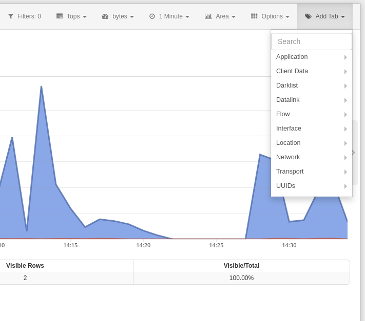
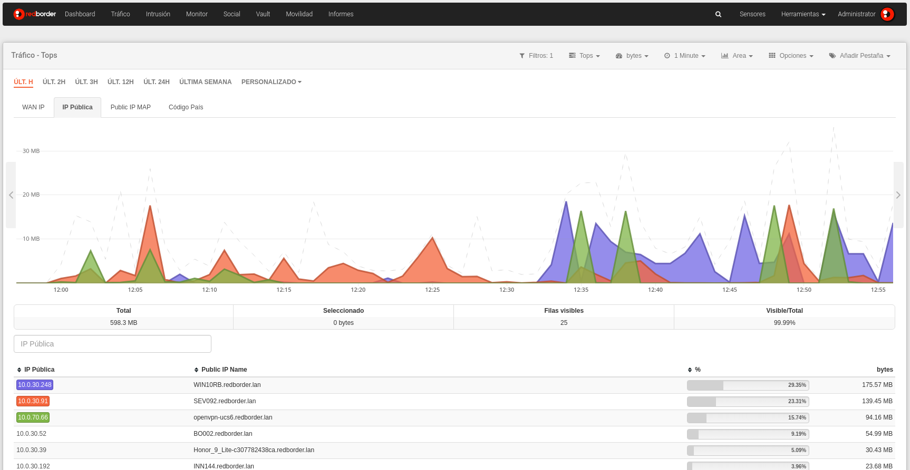

# Menú y opciones de los módulos

En el area de análisis de la barra de menú (barra superior, margen izquierdo), podemos encontrar diferentes secciones correspondientes a las Apps que hemos integrado en la plataforma de Redborder.

Posteriormente veremos las diferentes opciones para la visualización de datos, tipos de gráficos, granularidad (grado máximo de detalle temporal para una consulta de eventos) y atributos que pueden ser combinados para obtener un visualizador de tráfico de red totalmente personalizable.

Vista general de un módulo

## Opciones disponibles en el submenú

### Filtros

Permiten a los usuarios aislar una porción de la información para detallarla. En esta pestaña puede ver el número de filtros que han sido aplicados para aplicar acciones sobre ellos:

- *Busqueda avanzada.*
- *Crear una alarma.*
- *Crear un widget.*

Filtros

### Vistas

Ofrece diferentes opciones para mostrar la información.

- *Raw*: eventos en bruto.
- *Tops*: muestra la suma total de datos de diferentes eventos para mostrarlos como uno solo.
- *Comparar*: comparación de eventos dentro de un periodo de tiempo.
- *Único*: muestra el número de eventos únicos, agrupados según se indique.

Vistas

### Agregación

Hay diferentes valores o unidades de medida en los que los datos pueden ser mostrados. Por ejemplo, flows por segundo (flows/s) o bytes por segundo (bps). Tenga en cuenta que cada módulo tiene sus propias opciones de agregación.

Agregación

### Granularidad

Indica el grado de detalle temporal que puede mostrar la información. El mínimo valor para la granularidad es un minuto.

Granularidad

### Gráfico

Muestra los diferentes tipos de gráficos entre los que podemos mostrar los datos. Los tipos de gráficos disponibles varían dependiendo de la vista seleccionada. Son los siguientes:

Tipo de gráfico: Área

Tipo de gráfico: Líneas

Tipo de gráfico: Barras

Tipo de gráfico: Barras apiladas

Tipo de gráfico: Acumulado

### Opciones

En esta sección, el usuario puede realizar varias acciones para administrar los datos que se muestran. Las opciones varían según la vista seleccionada.

- *Mostrar total filtrado/Ocultar total filtrado*: muestra u oculta el gráfico considerando los filtros seleccionados.
- *Exportar a CSV*: proporciona la opción de exportar a CSV un informe de cualquier campo seleccionando el límite del evento.
- *Máquina del tiempo*: permite cambiar la fecha/hora de la máquina para poder ver toda la información y los eventos que han transcurrido en ese período de tiempo.
- *Ordenar agregaciones*: permite cambiar el orden de las agregaciones que se muestran en el módulo.
- *Guardar pestañas como predeterminadas*: al seleccionar esta opción, se puede modificar el diseño de pestañas predeterminado.

Opciones

### Atributos

Los eventos recibidos por el Manager consisten en un par "columna: valor". Los valores dados en cada columna pueden entenderse como datos específicos del evento que son los que realmente proporcionan información. Estos son los llamados "atributos".

Los atributos pueden ser mostrados de diferentes maneras: como pestañas o como columnas (Añadir Pestañas/Columnas) dependiendo de la vista en la que se encuentre.

Atributos

Todos los atributos tienen un significado y funcionalidad específica. Por ejemplo, en el módulo de Tráfico podemos observar atributos muy relevantes como *Public IP*, el cual muestra la dirección IP real de los dispositivos que se encuentran en la red, *Public IP MAP*, que indica su posición en el mapa, o *Country Code*, el cual indica el país al que pertenece.

Atributos: Vista general

## Cuerpo de la pantalla

### Filtrado por periodo de tiempo

A la izquierda, un poco más abajo del submenú se encuentran los accesos directos a eventos filtrados basados en periodos de tiempo. Los períodos definidos en la plataforma son Última hora, 2 horas, 3 horas, 12 horas, 24 horas y última semana.

Filtros de período de tiempo

Existe la posibilidad de seleccionar un periodo de tiempo diferente del ofrecido por defecto. Dependiendo de las necesidades del usuario, puede hacer una selección personalizada del periodo mediante la opción Personalizado. Posteriormente se especifica el procedimiento a seguir para realizar un filtro temporal personalizado.

### Pestañas de atributos

Información clasificada del tráfico de red por atributos. Navegando por cada una de las pestañas podemos conocer en detalle los valores asociados con los atributos que se han seleccionado.

Pestañas de atributos

!!! info "Ten en cuenta..."
    El usuario puede cambiar el orden en el que se muestran las pestañas en cualquier momento. Para hacerlo debe arrastrar y soltar la pestaña en la posición deseada.

    Esta parte del cuerpo no se muestra en la vista Raw.

### Vista

En esta area los datos son mostrados de acuerdo con la vista seleccionada y el tipo de gráfico. Al colocar el ratón en cualquiera de los puntos que componen el gráfico, un cuadro de dialogo muestra en detalle la información mostrada para ese instante de tiempo, agregación y atributo.

Vista

### Resumen

Bajo el area de la *Vista* hay un resumen de todos los datos mostrados, tanto en la vista como en la tabla. En el siguiente orden, este resumen indica el valor de agregación total de todos los datos cargados, el valor de agregación total de todos los datos cargados y seleccionados, el número de filas de datos cargados y el porcentaje de valor agregado de los datos cargados del total de datos.

Resumen

### Motor de búsqueda

Permite realizar una búsqueda por atributo. Las búsquedas se convierten automáticamente en filtros, tal y como veremos más adelante.

Motor de búsqueda

### Tabla de datos

Muestra los valores clasificados por tipo de atributo seleccionado. Por ejemplo, cada fila podría mostrar cada una de las IPs de origen (Columna/Atributo: SRC Address) con el porcentaje de detalle bytes (agregación) que consume ese elemento dentro de la red.

Para el análisis aislado de uno o más elementos de esta barra (seleccionar como filtro), debe hacer clic en el elemento que desea filtrar y luego presionar sobre el botón correspondiente que aparecerá junto al motor de búsqueda.

Tabla de datos

!!! info "Ten en cuenta..."
    Al posicionar el cursor sobre cualquiera de los elementos de la tabla de datos se mostrará un menú con las diferentes acciones que pueden ser ejecutadas en ese elemento. Dependiendo del tipo de atributo, se mostrarán las opciones de ordenado en el menú contextual.
