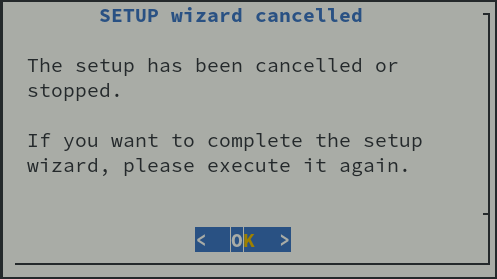
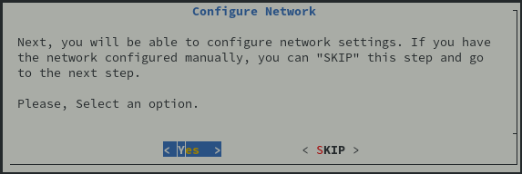
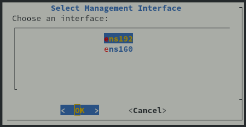
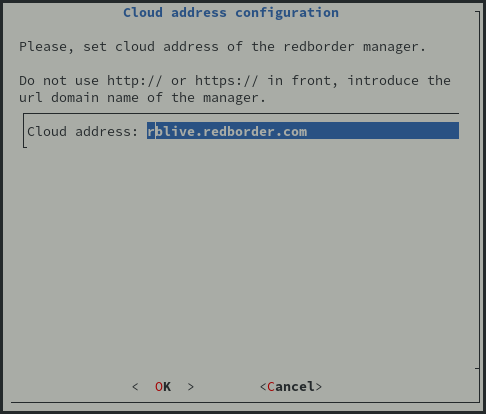
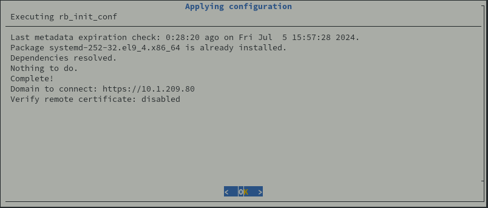

# Instalación del Proxy con redborder Live Registration

## Requisitos

El proxy cliente de Redborder es un software que tiene requisitos mínimos para funcionar correctamente. Los elementos esenciales mínimos requeridos para la instalación, así como los recomendados para un rendimiento adecuado, se muestran en la siguiente tabla:

**Requisitos para la instalación**
=== "Mínimos"
    * Disco: 16 GB
    * RAM: 1 GB
    * CPU: 1 núcleo
    * Interfaces de red: Al menos dos

=== "Recomendados"
    * Disco: 32 GB
    * RAM: 8 GB
    * CPU: 4 núcleo
    * Interfaces de red: Al menos dos

## Proceso de instalación

El primer paso para comenzar a monitorear su red con RedBorder es obtener los últimos paquetes oficiales de RedBorder para Rocky Linux 9, disponibles en [repo.redborder.com](https://repo.redborder.com).

## Installing the RPM

``` bash title="Última versión"
dnf install epel-release -y && rpm -ivh https://repo.redborder.com/ng/latest/rhel/9/x86_64/redborder-repo-latest-1.0.0-1.el9.rb.noarch.rpm
```

``` bash title="Proxy"
dnf install redborder-proxy -y
```

With the packages downloaded and installed, the next step is to configure RedBorder. To do this, log out of the console session and log back in. You can use a basic command for this:

``` bash title="Relogin"
/bin/bash --login
```

This will update the paths to the scripts, allowing us to execute the setup command:

``` bash title="Lanzamiento del asistente de instalación"
rb_setup_wizard
```

El cual iniciará el **asistente de instalación** de la plataforma en consola para funcionar como guía durante todo el proceso.

## Asistente de instalación

Habiendo iniciado el **asistente de instalación** para la plataforma en la consola, se puede utilizar como guía durante todo el proceso. La primera pantalla que se muestra nos ofrece también un índice de los próximos pasos.


Iniciando el asistente

Si no está seguro sobre la configuración actual, puede cancelar con la opción "No", la cual mostrará la siguiente pantalla antes de volver a la vista de la consola.



Cancelando el asistente

!!! warning "Cancelación..."
    La opción "No" cancelará todo el proceso de instalación, lo que significa que se perderá toda la configuración realizada durante el proceso.

### Configuración de red

Este paso es opcional. Si está seguro de que las interfaces de red ya están configuradas, puede omitir este paso. De lo contrario, entra en la configuración presionando "Sí".



Inicio de la configuración de red

En el recuadro inferior se listan las interfaces de red existentes en el equipo en cuestión. Debajo de todas las interfaces que posee el equipo, está la opción `Finalize`, que podemos seleccionar **después de haber configurado** exitosamente las interfaces.


Configuración de red

Al seleccionar una interfaz y entrar en ella, se nos da la opción de configurarla con una dirección IP estática o que esta funcione dinámicamente (con DHCP).


Configuración de interfaz de red

En caso de seleccionar la opción de IP estática, se deberá especificar la IP, la máscara de red y la puerta de enlace por defecto:


Configuración de interfaz estática

## Seleccionar interfaz de gestión

Debido a que el proxy tiene al menos dos interfaces, en este paso debemos determinar cuál es la de gestión.



Seleccionar interfaz de gestión

### Configuración de DNS

El asistente de instalación le dará la opción de elegir si quiere o no configurar servidores DNS, si es que realmente se desea configurar un DNS.


Empezar la configuración de los DNS

Si necesita configurar DNS, configura al menos un servidor. Esto se puede hacer en la pantalla siguiente:


Configuración de DNS

### Configuración con el servidor remoto

El proxy se asociará a un manager o clúster con el que compartir los datos capturados. Para que se pueda asociar es necesario indicar la dirección del manager o clúster. Se puede indicar tanto una dirección de dominio como una IP.



Configuración con el servidor remoto

### Fin de la configuración

Antes de aplicar la configuración, el asistente nos resumirá toda la información rellenada, a la espera de que el usuario la acepte.

[!Aceptar configuración](images/ch01_apply_conf.png)

Aceptar configuración

### Fin de la instalación

La instalación casi ha terminado, sólo hay que esperar a que el proceso finalice.



Aplicando Configuración

Pulse "OK" para volver a la vista de consola.

Adicionalmente, puede observar los logs del proceso de registro con el manager mediante el siguiente comando: 
``` bash title="Print the setup logs"
journalctl -u rb-bootstrap -f
```

Al final del proceso de instalación journal mostrará lo siguiente:


## ¿Qué es lo siguiente?

En el siguiente capítulo terminaremos de asociar el proxy al manager para que pueda retransmitir datos.
